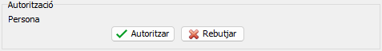

# [..](..)\Comandes

## MArticlePreparaExcepcio

### Index

- [Index](#index)
- [Descripcio](#descripcio)
  - [Taules](#taules)
- [Events](#events)
  - [procedure FormCreate(Sender: TObject)](#procedure-formcreatesender-tobject)
  - [procedure FormShow(Sender: TObject)](#procedure-formshowsender-tobject)
    - [FormShow\\ procedure ProximesDatesVigencia](#formshow-procedure-proximesdatesvigencia)
  - [procedure FormClose(Sender: TObject; var Action: TCloseAction)](#procedure-formclosesender-tobject-var-action-tcloseaction)
  - [procedure bbOkClick(Sender: TObject)](#procedure-bbokclicksender-tobject)
    - [bbOkClick\\ procedure CopiarExcepcio](#bbokclick-procedure-copiarexcepcio)
    - [bbOkClick\\ procedure InsertarExcepcio(Familia: string)](#bbokclick-procedure-insertarexcepciofamilia-string)
    - [bbOkClick\\ procedure CrearCorreu(dades: TDadesEmail)](#bbokclick-procedure-crearcorreudades-tdadesemail)
      - [bbOkClick\\CrearCorreu\\ function ObtenirAmbitExcepcio: string](#bbokclickcrearcorreu-function-obtenirambitexcepcio-string)
      - [bbOkClick\\CrearCorreu\\ function ObtenirTipusExcepcio: string](#bbokclickcrearcorreu-function-obtenirtipusexcepcio-string)
    - [bbOkClick\\ function EmailNotificacio(TipusEmail: integer): string](#bbokclick-function-emailnotificaciotipusemail-integer-string)
    - [bbOkClick\\ procedure SetPersonaSolicitat(Persona: integer)](#bbokclick-procedure-setpersonasolicitatpersona-integer)
    - [bbOkClick\\ function TipusEmailResponsable: integer](#bbokclick-function-tipusemailresponsable-integer)
    - [bbOkClick\\ procedure ProcessarExcepcio](#bbokclick-procedure-processarexcepcio)
  - [procedure btnAutoritzarClick(Sender: TObject)](#procedure-btnautoritzarclicksender-tobject)
    - [btnAutoritzarClick\\ function ObtenirAmbitExcepcio: string](#btnautoritzarclick-function-obtenirambitexcepcio-string)
    - [btnAutoritzarClick\\ function ObtenirTipusExcepcio: string](#btnautoritzarclick-function-obtenirtipusexcepcio-string)
  - [procedure btnRebutjarClick(Sender: TObject)](#procedure-btnrebutjarclicksender-tobject)
    - [btnRebutjarClick\\ function ObtenirAmbitExcepcio: string](#btnrebutjarclick-function-obtenirambitexcepcio-string)
    - [btnRebutjarClick\\ function ObtenirTipusExcepcio: string](#btnrebutjarclick-function-obtenirtipusexcepcio-string)
  - [procedure bbFamiliaClick(Sender: TObject)](#procedure-bbfamiliaclicksender-tobject)
  - [procedure bbArticleClick(Sender: TObject)](#procedure-bbarticleclicksender-tobject)
  - [procedure dxMemData1CalcFields(DataSet: TDataSet)](#procedure-dxmemdata1calcfieldsdataset-tdataset)
  - [procedure rgTipusExcepcioClick(Sender: TObject)](#procedure-rgtipusexcepcioclicksender-tobject)
  - [procedure bbClientClick(Sender: TObject)](#procedure-bbclientclicksender-tobject)
  - [procedure rgAmbitExcepcioPropertiesEditValueChanged(Sender: TObject)](#procedure-rgambitexcepciopropertieseditvaluechangedsender-tobject)
  - [procedure bbCancelClick(Sender: TObject)](#procedure-bbcancelclicksender-tobject)
  - [procedure rgTarifaPropertiesChange(Sender: TObject)](#procedure-rgtarifapropertieschangesender-tobject)
- [Metodes](#metodes)
  - [procedure EstablirPemisosTipusClient](#procedure-establirpemisostipusclient)
  - [procedure AssignarTipusExcepcio](#procedure-assignartipusexcepcio)
  - [procedure ActivaExcepcio](#procedure-activaexcepcio)
  - [procedure LlegirFamilies](#procedure-llegirfamilies)
  - [function EsTotCorrecte: Boolean](#function-estotcorrecte-boolean)
    - [EsTotCorrecte\\ function CheckExcepcionsSolapades: Boolean](#estotcorrecte-function-checkexcepcionssolapades-boolean)
    - [EsTotCorrecte\\ function CheckAmbitCorrecte: Boolean](#estotcorrecte-function-checkambitcorrecte-boolean)
    - [EsTotCorrecte\\ function CheckCampsAmbitCorrectes: Boolean](#estotcorrecte-function-checkcampsambitcorrectes-boolean)
  - [function CheckPermisos: Boolean](#function-checkpermisos-boolean)
    - [CheckPermisos\\ function CheckAmbit: Boolean](#checkpermisos-function-checkambit-boolean)
    - [CheckPermisos\\ procedure ObrirQueryPermisos](#checkpermisos-procedure-obrirquerypermisos)
    - [CheckPermisos\\ function CheckPreu: Boolean](#checkpermisos-function-checkpreu-boolean)
    - [CheckPermisos\\ function CheckTipusExcepcio: Boolean](#checkpermisos-function-checktipusexcepcio-boolean)
  - [procedure LlegirPreus](#procedure-llegirpreus)
  - [function HiHaAltresExcepcionsSolapadesAmbExcepcioActualGrup: Boolean](#function-hihaaltresexcepcionssolapadesambexcepcioactualgrup-boolean)
  - [function HiHaAltresExcepcionsSolapadesAmbExcepcioActualClient: Boolean](#function-hihaaltresexcepcionssolapadesambexcepcioactualclient-boolean)
  - [procedure CopyFields(DataSetBase: TDataSet; DataSetFill: TDataSet)](#procedure-copyfieldsdatasetbase-tdataset-datasetfill-tdataset)
  - [procedure SetPersonaAutoritza(Persona: integer)](#procedure-setpersonaautoritzapersona-integer)
  - [procedure NetejarCamps](#procedure-netejarcamps)
  - [function LlegirTipusABCClient: string](#function-llegirtipusabcclient-string)
  - [procedure CopiarExcepcioTotesFamilies(Id: integer) {DEPRECATED}](#procedure-copiarexcepciototesfamiliesid-integer-deprecated)
- [SQL](#sql)
  - [SQL\\ quPreusArticle](#sql-qupreusarticle)
  - [SQL\\ quClient](#sql-quclient)
  - [SQL\\ quPersonal](#sql-qupersonal)
  - [SQL\\ quExcepcionsSolicitades](#sql-quexcepcionssolicitades)
  - [SQL\\ quCheckExcepcionsSolapadesGrups](#sql-qucheckexcepcionssolapadesgrups)
  - [SQL\\ quCheckExcepcioNoExistentEntreDates](#sql-qucheckexcepcionoexistententredates)
  - [SQL\\ quFamilies](#sql-qufamilies)
  - [SQL\\ quFamiliaXsubgrupXgrupXarticle](#sql-qufamiliaxsubgrupxgrupxarticle)
  - [SQL\\ quEmailNotificar](#sql-quemailnotificar)
  - [SQL\\ quAutoritzarExcepcions](#sql-quautoritzarexcepcions)
  - [SQL\\ quRebutjarExcepcio](#sql-qurebutjarexcepcio)
  - [SQL\\ quExcepcionsPermisosTipusClient](#sql-quexcepcionspermisostipusclient)

<!-- markdownlint-disable-next-line MD033 -->
<div class="page"/>

### Descripcio

Aquest formulari permet crear i solicitar excepcions per a clients.
Esta tot vinculat al **dsExcepcions** el qual sera diferents taules segons si es una excepcio de fresc/llotja/congelat, una solicitut o una excepcio de grup (no habilitat).

![][MArticlePreparaExcepcio]

#### Taules

- Excepcions
  - Fresc: **ArticlePreparaClients**
  - Llotja: **ArticleLlotjaExcepcions**
  - Congelat: **ArticleCongelatClients**
- Solicituts: **ExcepcionsClientsSolicituts**
- Excepcions de Grups de Clients: **ClientsGrupsExcepcions**

### Events

#### procedure FormCreate(Sender: TObject)

Aqui inicialitzem les variables.

``` Delphi
procedure TMFArticlePreparaExcepcio.FormCreate(Sender: TObject);
begin
  FPreuCost := 0;
  FPreuVenda1 := 0;
  FPreuVenda2 := 0;
  FPreuVenda3 := 0;
  FPreuVenda5 := 0;

  lbNomArticle.Caption := '';
  lbNomFamilia.Caption := '';
  lbNomGrup.Caption := '';
  lbNomSubGrup.Caption := '';
end;
```

#### procedure FormShow(Sender: TObject)

Ens guardem el DataSet amb el que arranquem el proces, ja que en cas de haver de solicitar la excepcio, es canvia el DataSet Actiu (dsExcepcions.DataSet) per el de solicituts.
Obtenim el correu del comercial segons el client.
[EstablirPermisosTipusClient](#procedure-establirpemisostipusclient)
[AssignarTipusExcepcio](#procedure-assignartipusexcepcio)
[ActivaExcepcio](#procedure-activaexcepcio)
[LlegirFamilies](#procedure-llegirfamilies)
[ProximesDatesVigencia](#formshow-procedure-proximesdatesvigencia)

[SQL quClient](#sql-quclient)
[SQL quPersonal](#sql-qupersonal)

Finalment s'assigna si existeix en el DataSet, el nom de l'ambit en el Label que toca i en el cas de ser un Article, tambe es fa lectura dels preus per poder-los mostrar.

!!! ULL: es desactiva l'event (rgAmbitExcepcio.Properties.OnEditValueChanged) per tema que donava errors al tenir algunes dades en blanc.

``` Delphi
procedure TMFArticlePreparaExcepcio.FormShow(Sender: TObject);
begin
  Self.Caption := 'Excepció ' + FTipusArticle;
  DataSetBase := dsExcepcions.DataSet;

  with quClient, Parameters do
  begin
    Close;
    ParamByName('Client').Value := dsExcepcions.DataSet.FieldByName('Client').Value;
    Open;
    EmailComercial := quClientEmail.AsString;
    Close;
  end;

  // Segons el tipus de client, llegim els permisos que t� per cada control.
  EstablirPemisosTipusClient;

  rgAmbitExcepcio.Properties.OnEditValueChanged := nil;
  try
    with quPersonal do
    begin
      Close;
      Open;
    end;
    AssignarTipusExcepcio;
    ActivaExcepcio;
    LlegirFamilies;
    ProximesDatesVigencia;

    lbNomClient.Caption := FNomClient;

    case rgAmbitExcepcio.ItemIndex of
      AMBIT_FAMILIA:
        begin
          if dsExcepcions.DataSet.FindField('NomFamilia') <> nil then
            lbNomFamilia.Caption := dsExcepcions.DataSet.FieldByName('NomFamilia').AsString;
        end;
      AMBIT_GRUP:
        begin
          if dsExcepcions.DataSet.FindField('NomGrup') <> nil then
            lbNomGrup.Caption := dsExcepcions.DataSet.FieldByName('NomGrup').AsString;
        end;
      AMBIT_SUBGRUP:
        begin
          if dsExcepcions.DataSet.FindField('NomSubGrup') <> nil then
            lbNomSubGrup.Caption := dsExcepcions.DataSet.FieldByName('NomSubGrup').AsString;
        end;
      AMBIT_ARTICLE:
        begin
          if dsExcepcions.DataSet.FindField('NomArticle') <> nil then
            lbNomArticle.Caption := dsExcepcions.DataSet.FieldByName('NomArticle').AsString;
          if dsExcepcions.DataSet.FindField('Article') <> nil then
            if dsExcepcions.DataSet.FieldByName('Article').Value <> '' then
              LlegirPreus;
        end;
    end;

  finally
    rgAmbitExcepcio.Properties.OnEditValueChanged :=
      rgAmbitExcepcioPropertiesEditValueChanged;
  end;
end;
```

##### FormShow\ procedure ProximesDatesVigencia

Aqui calculem unes dates sugerides per a poder facilitar l'us de l'eina. Simplement son 2 desplegables que tenen els proxims inicis i finals de mes dels proxims 12 mesos.

Les taules en memoria tenen l'event [**OnCalcFields**](#procedure-dxmemdata1calcfieldsdataset-tdataset).

```Delphi
procedure ProximesDatesVigencia;
  var
    I: integer;
    anyI, mesI, anyF, mesF: word;
  begin
    dxMemData1.Close;
    taDatesInici.Close;

    dxMemData1.Open;
    taDatesInici.Open;

    dxMemData1.Append;
    taDatesInici.Append;

    mesI := Monthof(dsExcepcions.DataSet.FieldByName('DataInici').AsDateTime);
    anyI := Yearof(dsExcepcions.DataSet.FieldByName('DataInici').AsDateTime);
    mesF := Monthof(dsExcepcions.DataSet.FieldByName('DataFi').AsDateTime);
    anyF := Yearof(dsExcepcions.DataSet.FieldByName('DataFi').AsDateTime);
    I := 0;

    while I < 13 do
    begin
      dxMemData1.Append;
      dxMemData1Data.Value := trunc(EndOfAMonth(anyF, mesF));
      dxMemData1.Post;

      taDatesInici.Append;
      taDatesIniciData.Value := trunc(StartOfAMonth(anyI, mesI));
      taDatesInici.Post;

      mesF := mesF + 1;

      if mesF > 12 then
      begin
        mesF := mesF - 12;
        anyF := anyF + 1;
      end;

      mesI := mesI + 1;

      if mesI > 12 then
      begin
        mesI := mesI - 12;
        anyI := anyI + 1;
      end;

      I := I + 1;
    end;
  end;
```

#### procedure FormClose(Sender: TObject; var Action: TCloseAction)

Al tancar el formulari es descarten qualsevol dels canvis fets.

```Delphi
procedure TMFArticlePreparaExcepcio.FormClose(Sender: TObject; var Action: TCloseAction);
begin
  with dsExcepcions.DataSet do
  begin
    if State in [dsEdit, dsInsert] then
      Cancel;
  end;
end;
```

#### procedure bbOkClick(Sender: TObject)

[EsTotCorrecte](#function-estotcorrecte-boolean)
[CheckPermisos](#function-checkpermisos-boolean)
Si tot es correcte i tenim permisos, informem que nosaltres mateixos autoritzem i marquem k no hi ha solicitut, un cop informat aixo, es processa l'excepcio.

En cas de ser tot correcte pero no tenir permisos, consulta a l'usuari per generar una solicitut.
Si l'usuari selecciona que si, utilitzarem el **quExcepcionsSolicitades** per guardar les dades de la excepcio actual a una solicitut.
Proces:

1. Copiar contingut del DataSet actual al de solicituts ([CopyFields](#procedure-copyfieldsdatasetbase-tdataset-datasetfill-tdataset))
2. Descartar canvis en el DataSet de treball
3. Vincular al GUI el DataSet de Solicituts
4. Informem que nosaltres som la persona solicitant i que no hi ha autoritzacio
5. Finalment es processa l'excepcio.

[ProcessarExcepcio](#bbokclick-procedure-processarexcepcio)

[SQL quExcepcionsSolicitades](#sql-quexcepcionssolicitades)

```Delphi
procedure TMFArticlePreparaExcepcio.bbOkClick(Sender: TObject);
var
  Client: integer;
  NomClient: string;
  Tarifa, TipusExcepcio: integer;
  PercentInc, ImportInc, PercentIncVenda, ImportFix: real;
  DataInici, DataFi: TDateTime;
  AliasPersonaAutoritza, Motiu, Ambit, NomAmbit, AliasPersonaSolicitat: string;
  PersonaSolicita, PersonaAutoritza: integer;
  DataSolicitat: TDateTime;
  Id: integer;
  CursorVell: TCursor;
  dades: TDadesEmail;
begin
  if (EsTotCorrecte) then
  begin
    dsExcepcions.DataSet.Edit;
    // En cas de tenir permis suficient per a aquest tipus, es fara la excepcio
    // D'altra manera es preguntara si es vol solicitar la excepcio a un
    // superior amb privilegis
    if CheckPermisos then
    begin
      SetPersonaSolicitat(-1);
      SetPersonaAutoritza(LlegirPersonaReg);

      ProcessarExcepcio;
    end

    // Permet crear excepció pendent d'autoritzar.
    // De moment la desactivem perquè no tenim controlades aquestes excepcions
    // pendents d'autoritzar 5-10-2023
    else
    begin
      if dxMessageDlg('No tens permisos per fer aquesta excepcio.' + #13 + #10 +
        'Vols solicitar aquesta excepcio al teu superior?', mtWarning, mbYesNo,
        0, mbYes) = mrYes then
      begin
        with quExcepcionsSolicitades do
        begin
          Close;
          Open;
          Append;
        end;

        CopyFields(DataSetBase, quExcepcionsSolicitades);
        DataSetBase.Cancel;

        dsExcepcions.DataSet := quExcepcionsSolicitades;
        quExcepcionsSolicitadesOrigen.Value := TipusArticle;

        SetPersonaSolicitat(LlegirPersonaReg);
        SetPersonaAutoritza(-1);

        ProcessarExcepcio;
      end;
    end;
  end
  else
  begin
    ShowMessage('Excepcio no valida, revisa les dades.');
  end;
end;
```

##### bbOkClick\ procedure CopiarExcepcio

Guardem les dades a variables en memoria, per a poder utilitzar-les mes endavant al copiar les excepcions de families.

```Delphi
  procedure CopiarExcepcio;
  begin
    with dsExcepcions.DataSet do
    begin
      Client := FieldByName('Client').AsInteger;
      if FindField('NomClient') <> nil then
        NomClient := FieldByName('NomClient').AsString;
      Tarifa := FieldByName('Tarifa').AsInteger;
      TipusExcepcio := FieldByName('TipusExcepcio').AsInteger;
      PercentInc := FieldByName('PercentInc').AsFloat;
      ImportInc := FieldByName('ImportInc').AsFloat;
      PercentIncVenda := FieldByName('PercentIncVenda').AsFloat;
      ImportFix := FieldByName('ImportFix').AsFloat;
      if not FieldByName('DataInici').IsNull then
        DataInici := FieldByName('DataInici').AsDateTime
      else
        DataInici := 0;
      if not FieldByName('DataFi').IsNull then
        DataFi := FieldByName('DataFi').AsDateTime
      else
        DataFi := 0;
      PersonaAutoritza := FieldByName('PersonaAutoritza').AsInteger;
      AliasPersonaAutoritza := FieldByName('AliasPersonaAutoritza').AsString;
      Motiu := FieldByName('Motiu').AsString;
      Ambit := FieldByName('Familia').AsString + FieldByName('Grup').AsString +
        FieldByName('Subgrup').AsString + FieldByName('Article').AsString;
      if FindField('NomFamilia') <> nil then
        if FindField('NomGrup') <> nil then
          if FindField('NomSubgrup') <> nil then
            if FindField('NomArticle') <> nil then
              NomAmbit := FieldByName('NomFamilia').AsString + FieldByName('NomGrup').AsString
                + FieldByName('NomSubgrup').AsString + FieldByName('NomArticle').AsString;
      if NomAmbit = '' then
        NomAmbit := lbNomArticle.Caption + lbNomFamilia.Caption + lbNomGrup.Caption
          + lbNomSubGrup.Caption;

      PersonaSolicita := FieldByName('PersonaSolicitat').AsInteger;
      if FindField('AliasPersonaSolicitat') <> nil then
        AliasPersonaSolicitat := FieldByName('AliasPersonaSolicitat').AsString;
      if FindField('DataSolicitat') <> nil then
        DataSolicitat := FieldByName('DataSolicitat').AsDateTime;
    end;
  end;
```

##### bbOkClick\ procedure InsertarExcepcio(Familia: string)

Crea l'excepcio copiada per la familia pasada per param.

La columna Origen nomes existeix a la taula de solicitut.
La columna PersonaAutoritza ha de ser NULL, si es 0 s'ha de passar a null, ja que sino es detecta com a autoritzada. Limitacio de utilitzar Integer.

```Delphi
  procedure InsertarExcepcio(Familia: string);
  begin
    with dsExcepcions.DataSet do
    begin
      Insert;
      FieldByName('Client').AsInteger := Client;
      FieldByName('Familia').AsString := Familia;

      FieldByName('Tarifa').AsInteger := Tarifa;
      FieldByName('TipusExcepcio').AsInteger := TipusExcepcio;
      FieldByName('PercentInc').AsFloat := PercentInc;
      FieldByName('ImportInc').AsFloat := ImportInc;
      FieldByName('PercentIncVenda').AsFloat := PercentIncVenda;
      FieldByName('ImportFix').AsFloat := ImportFix;
      if DataInici <> 0 then
        FieldByName('DataInici').AsDateTime := DataInici;
      if DataFi <> 0 then
        FieldByName('DataFi').AsDateTime := DataFi;

      if PersonaAutoritza <> 0 then
        FieldByName('PersonaAutoritza').AsInteger := PersonaAutoritza
      else
        FieldByName('PersonaAutoritza').Clear;

      FieldByName('AliasPersonaAutoritza').AsString := AliasPersonaAutoritza;
      FieldByName('Motiu').AsString := Motiu;
      FieldByName('PersonaSolicitat').AsInteger := PersonaSolicita;
      if FindField('Origen') <> nil then
      begin
        FieldByName('Origen').Value := TipusArticle;
      end;
      if FindField('AliasPersonaSolicitat') <> nil then
        FieldByName('AliasPersonaSolicitat').AsString := AliasPersonaSolicitat;
      if FindField('DataSolicitat') <> nil then
        if DataSolicitat <> 0 then
          FieldByName('DataSolicitat').AsDateTime := DataSolicitat
        else
          FieldByName('DataSolicitat').Clear;
      Post;
    end;
  end;
```

##### bbOkClick\ procedure CrearCorreu(dades: TDadesEmail)

[SQL quClient](#sql-quclient)

Si la excepcio esta autoritzada, ens dona una capçalera dient "[CANVI EXCEPCIÓ PREU CLIENT]" en canvi si no esta autoritzada, solicitut, ens diu "[SOLICITA EXCEPCIÓ PREU CLIENT]".
Utilitzem el [quPersonal](#sql-qupersonal) per obtenir l'alias de la persona, sino nomes ens diu el codi de personal.

Esquema del correu:

Sistema de Excepcions de Puignau\
\--------------------------------------------\
Excepcio per al Client : **CodiClient** **NomClient**\
[ObtenirAmbitExcepcio](#bbokclickcrearcorreu-function-obtenirambitexcepcio-string)\
[ObtenirTipusExcepcio](#bbokclickcrearcorreu-function-obtenirtipusexcepcio-string)\
Vigencia Excepcio: [**Data Inici Excepcio** - **Data Fi Excepcio**]\
\----\
Correu enviat **Data i Hora de enviament**

```Delphi
procedure CrearCorreu(dades: TDadesEmail);
  begin
    // llegim el client per obtenir el seu nom
    with quClient, Parameters do
    begin
      Close;
      ParamByName('Client').Value := Client;
      Open;
      NomClient := quClientNom.AsString;
      Close;
    end;

    if PersonaAutoritza <> 0 then
    begin

      if quPersonal.Locate('Persona', PersonaAutoritza, []) then
      begin
        dades.Subject := '[CANVI EXCEPCIÓ PREU CLIENT]' + quPersonalAlias.Value
          + ' - ' + inttostr(Client) + ' ' + NomClient + ']';
      end
      else
      begin
        dades.Subject := '[CANVI EXCEPCIÓ PREU CLIENT]' + inttostr(PersonaAutoritza)
          + ' - ' + inttostr(Client) + ' ' + NomClient + ']';
      end;
    end
    else
    begin
      if quPersonal.Locate('Persona', PersonaSolicita, []) then
      begin
        dades.Subject := '[SOLICITA EXCEPCIÓ PREU CLIENT]' + quPersonalAlias.Value
          + ' - ' + inttostr(Client) + ' ' + NomClient + ']';
      end
      else
      begin
        dades.Subject := '[SOLICITA EXCEPCIÓ PREU CLIENT]' + inttostr(PersonaSolicita)
          + ' - ' + inttostr(Client) + ' ' + NomClient + ']';
      end;
    end;

    with dades.Text do
    begin
      Add('Sistema de Excepcions de Puignau');
      Add('--------------------------------------------');
      Add('Excepcio per al Client : ' + inttostr(Client) + ' ' + NomClient);
      Add(ObtenirAmbitExcepcio);
      Add(ObtenirTipusExcepcio);
      Add('Vigencia Excepcio: [' + FormatDateTime('dd/MM/yyyy', DataInici) +
        ' - ' + FormatDateTime('dd/MM/yyyy', DataFi) + ']');
      Add('----');
      Add('Correu enviat ' + FormatDateTime('dd/mm/yyy, hh:nn:ss', Now));
    end;
  end;
```

###### bbOkClick\CrearCorreu\ function ObtenirAmbitExcepcio: string

Ens dona la informacio de l'ambit de l'excepcio.

```Delphi
    function ObtenirAmbitExcepcio: string;
    begin
      Result := 'Ambit Excepcio: ';
      if rgAmbitExcepcio.ItemIndex = 0 then
        Result := Result + 'Totes les Families '
      else if rgAmbitExcepcio.ItemIndex = 1 then
        Result := Result + 'Familia: ' + Ambit + ' ' + NomAmbit
      else if rgAmbitExcepcio.ItemIndex = 2 then
        Result := Result + 'Grup: ' + Ambit + ' ' + NomAmbit
      else if rgAmbitExcepcio.ItemIndex = 3 then
        Result := Result + 'SubGrup: ' + Ambit + ' ' + NomAmbit
      else
        Result := Result + 'Article: ' + Ambit + ' ' + NomAmbit;
      Result := Result + ' -- Estoc: ' + quPreusArticleUnitatsEstoc.AsString +
        ' -- Calculat: ' + quPreusArticleDataHora.AsString;
    end;
```

###### bbOkClick\CrearCorreu\ function ObtenirTipusExcepcio: string

Ens dona quina excepcio s'aplicara.

```Delphi
function ObtenirTipusExcepcio: string;
    begin
      Result := 'Tipus Excepcio : ';
      if TipusExcepcio = 1 then
        Result := Result + FloatToStr(PercentInc) + '% sobre el preu de cost '
      else if TipusExcepcio = 2 then
        Result := Result + FloatToStr(ImportInc) + '€ sobre el preu de cost'
      else if TipusExcepcio = 3 then
        Result := Result + FloatToStr(PercentIncVenda) +
          '% sobre el preu de Tarifa :' + inttostr(Tarifa)
      else
        Result := Result + FloatToStr(ImportFix) + '€ Preu Fix';
    end;
```

##### bbOkClick\ function EmailNotificacio(TipusEmail: integer): string

[quEmailNotificar](#sql-quemailnotificar)
Retorna tots els emails separats per ',' per a poder-los enviar un email a tots de cop.

```Delphi
function EmailNotificacio(TipusEmail: integer): string;
  var
    s: string;
  begin
    with quEmailNotificar, Parameters do
    begin
      Close;
      ParamByName('TipusEmail').Value := TipusEmail;
      // Responsable Notificar Excepcions
      Open;
      First;
      s := '';
      while not Eof do
      begin
        if s <> '' then
          s := s + ',';
        s := s + quEmailNotificarEmail.AsString;
        Next;
      end;
      Close;
      Result := s;
    end;
  end;
```

##### bbOkClick\ procedure SetPersonaSolicitat(Persona: integer)

Assigna la columna PersonaSolicitat i el seu alias, en cas de ser -1, assigna **NULL**

```Delphi
  procedure SetPersonaSolicitat(Persona: integer);
  begin
    if not (dsExcepcions.DataSet.State in dsEditModes) then
    begin
      dsExcepcions.DataSet.Edit;
    end;
    if Persona <> -1 then
    begin
      dsExcepcions.DataSet.FieldByName('PersonaSolicitat').Value := Persona;
      dsExcepcions.DataSet.FieldByName('DataSolicitat').Value := Now;
      if quPersonal.Locate('Persona', Persona, []) then
      begin
        dsExcepcions.DataSet.FieldByName('AliasPersonaSolicitat').Value :=
          quPersonalAlias.Value;
      end
      else
      begin
        dsExcepcions.DataSet.FieldByName('AliasPersonaSolicitat').Clear;
      end;
    end
    else
    begin
      dsExcepcions.DataSet.FieldByName('PersonaSolicitat').Clear;
      dsExcepcions.DataSet.FieldByName('AliasPersonaSolicitat').Clear;
    end;
  end;
```

##### bbOkClick\ function TipusEmailResponsable: integer

Obte el **TipusEmail** segons l'ambit seleccionat. Si es el de totes les families, s'utilitza una Familia estandar.
En el cas de no trobar el tipus indicat s'utilitza el de **FRESC**.

```Delphi
function TipusEmailResponsable: integer;
  var
    Fam: string;
  begin
    if not quFamiliaXsubgrupXgrupXarticle.Active then
    begin
      with quFamiliaXsubgrupXgrupXarticle, Parameters do
      begin
        quFamiliaXsubgrupXgrupXarticle.Close;

        ParamByName('RESPONSABLE_EXCEPCIONS_FRESC').Value :=
          TIPUSEMAIL_RESPONSABLE_EXCEPCIONS_FRESC;
        ParamByName('RESPONSABLE_EXCEPCIONS_LLOTJA').Value :=
          TIPUSEMAIL_RESPONSABLE_EXCEPCIONS_LLOTJA;
        ParamByName('RESPONSABLE_EXCEPCIONS_CONGE').Value :=
          TIPUSEMAIL_RESPONSABLE_EXCEPCIONS_CONGE;
        quFamiliaXsubgrupXgrupXarticle.Open;
      end;
    end;
    Result := TIPUSEMAIL_RESPONSABLE_EXCEPCIONS_FRESC;

    if rgAmbitExcepcio.ItemIndex = AMBIT_TOTES_FAMILIES then
    begin
      if TipusArticle = 'FEINA' then
        Fam := 'Z-TX'
      else if TipusArticle = 'CONGELAT' then
        Fam := 'CONGE'
      else if TipusArticle = 'LLOTJA' then
        Fam := 'PFC'
      else
        Fam := 'PF';

      if quFamiliaXsubgrupXgrupXarticle.Locate('Familia', Fam, []) then
        Result := quFamiliaXsubgrupXgrupXarticleEmail.Value;
    end
    else if rgAmbitExcepcio.ItemIndex = AMBIT_FAMILIA then
    begin
      if quFamiliaXsubgrupXgrupXarticle.Locate('Familia', Ambit, []) then
        Result := quFamiliaXsubgrupXgrupXarticleEmail.Value;
    end
    else if rgAmbitExcepcio.ItemIndex = AMBIT_GRUP then
    begin
      if quFamiliaXsubgrupXgrupXarticle.Locate('Grup', Ambit, []) then
        Result := quFamiliaXsubgrupXgrupXarticleEmail.Value;
    end
    else if rgAmbitExcepcio.ItemIndex = AMBIT_SUBGRUP then
    begin
      if quFamiliaXsubgrupXgrupXarticle.Locate('SubGrup', Ambit, []) then
        Result := quFamiliaXsubgrupXgrupXarticleEmail.Value;
    end
    else if quFamiliaXsubgrupXgrupXarticle.Locate('Article', Ambit, []) then
      Result := quFamiliaXsubgrupXgrupXarticleEmail.Value;
  end;
```

##### bbOkClick\ procedure ProcessarExcepcio

[FindField](https://docwiki.embarcadero.com/Libraries/Alexandria/en/Data.DB.TDataSet.FindField)

Les taules de excepcions, la de fresc te una columna que ens indica si la excepcio es de Peix o de Feina, aquesta funcionalitat no esta implementada a les taules de solicituts o grups de clients, per aixo en el cas de ser un grup de clients, no es guarda res.

Llavors es fa una corroboracio de dades en cas de ser ambit **tot**, seleccionarem la primera familia de la llista i l'aplicarem a la excepcio actual. Despres segons l'ambit es deixa a **NULL** els altres camps.

Un cop tot aixo, es copia l'excepcio a variables en memoria, les quals ens permetran duplicar les dades de les excepcions per les altres families en el cas de **totes les families**.
[CopiarExcepcio](#bbokclick-procedure-copiarexcepcio)

Un cop creada l'excepcio/solicitut, el que fem es generar un correu de notificacio segons la seguent taula:
|Tipus Usuari|Te Permis|Que envia|Assumpte|
|---|:---:|---|---|
|Comercial|S|No email||
|Comercial|N|Email a supervisor|[SOLICITA EXCEPCIÓ PREU CLIENT]|
|Cap de Zona|S|No email||
|Cap de Zona|N|Email a supervisor|[SOLICITA EXCEPCIÓ PREU CLIENT]|
|Supervisor|S|Email al comercial notificant el canvi desde direccio|[CANVI EXCEPCIÓ PREU CLIENT]|

Amb el contingut de [CrearCorreu](#bbokclick-procedure-crearcorreudades-tdadesemail).
El correu del supervisor es calcula amb la funcio [TipusEmailResponsable](#bbokclick-function-tipusemailresponsable-integer) el qual ens retorna un TipusEmail, que la funcio [EmailNotificacio](#bbokclick-function-emailnotificaciotipusemail-integer-string) ens retornara el correu desti.

Al final de tot, en el cas de estar en el l'ambit de tot, recorrerem totes les families i utilitzarem [InsertarExcepcio](#bbokclick-procedure-insertarexcepciofamilia-string) per a crear les excepcions de les altres families. !!! ULL: la primera familia ja s'ha fet al processar l'excepcio, ara nomes es fan de la segona en endavant.

[quFamilies](#sql-qufamilies)

```Delphi
  procedure ProcessarExcepcio;
  begin
    CursorVell := Screen.Cursor;
    try
      Screen.Cursor := crHourGlass;

      with dsExcepcions.DataSet do
      begin
        if not (State in [dsEdit, dsInsert]) then
        begin
          Edit;
        end;

        if not Grup then
        begin
          if FindField('EsFeinaNeteja') <> nil then
          begin
            // Si estem treballant un FRESC o FEINA cal actualitzar el camp corresponent
            if (FTipusArticle = 'FRESC') then
              FieldByName('EsFeinaNeteja').AsBoolean := False;

            if (FTipusArticle = 'FEINA') then
              FieldByName('EsFeinaNeteja').AsBoolean := True;
          end;
        end;

        // Abans de guardar, si ens han demanat TOTES LES FAMILIES, posem com a
        // fam�lia la primera del dataset de quFamilies. Despr�s per la resta
        // copiarem l'excepci�.
        if rgAmbitExcepcio.ItemIndex = AMBIT_TOTES_FAMILIES then
        begin
          quFamilies.First;
          FieldByName('Familia').AsString := quFamiliesFamilia.AsString;
        end;

        // Ens assegurem que els camps de Fam�lia, Grup, Subgrup i Article s�n
        // coherents amb el tipus d'excepci� demanat.
        if (rgAmbitExcepcio.ItemIndex = AMBIT_TOTES_FAMILIES) or (rgAmbitExcepcio.ItemIndex
          = AMBIT_FAMILIA) then
        begin
          FieldByName('Grup').Clear;
          FieldByName('SubGrup').Clear;
          FieldByName('Article').Clear;
        end
        else if (rgAmbitExcepcio.ItemIndex = AMBIT_GRUP) then
        begin
          FieldByName('Familia').Clear;
          FieldByName('SubGrup').Clear;
          FieldByName('Article').Clear;
        end
        else if (rgAmbitExcepcio.ItemIndex = AMBIT_SUBGRUP) then
        begin
          FieldByName('Familia').Clear;
          FieldByName('Grup').Clear;
          FieldByName('Article').Clear;
        end
        else
        begin
          FieldByName('Familia').Clear;
          FieldByName('Grup').Clear;
          FieldByName('SubGrup').Clear;
        end;

        CopiarExcepcio;

        if State in [dsEdit, dsInsert] then
          Post;

        // Ens guardem l'ID de l'excepci� que acabem de guardar per si cal fer la
        // c�pia per altres fam�lies.
        Id := FieldByName('Id').AsInteger;
      end;

      if (dmPressupostos.TipusUsuari = USUARI_GESTIO_CLIENTS_COMERCIAL) or (dmPressupostos.TipusUsuari
        = USUARI_GESTIO_CLIENTS_CAP_ZONA) then
      begin
        if PersonaAutoritza = 0 then
        begin
        // Creació de les dades del correu
          dades := TDadesEmail.Create;
          CrearCorreu(dades);
        // Enviar Correu de notificació al responsable del canvi de preu.
          EnviarCorreuNotificacio(dades, EmailNotificacio(TipusEmailResponsable));
        end;
      end
      else
      begin
        // Creació de les dades del correu
        dades := TDadesEmail.Create;
        CrearCorreu(dades);
        // Enviar Correu de notificació al responsable del canvi de preu.
        if EmailComercial = '' then
        begin
          with quClient, Parameters do
          begin
            if not Active then
            begin
              Close;
              ParamByName('Client').Value := dsExcepcions.DataSet.FieldByName('Client').Value;
              Open;
            end;
            EmailComercial := quClientEmail.AsString;
            if not Active then
            begin
              Close;
            end;
          end;
          //EmailComercial := 'esteve.miquel@peixospuignau.net'
        end;
        EnviarCorreuNotificacio(dades, EmailComercial);
      end;

      // Després de guardar, si ens han demanat TOTES LES FAM�LIES, hem de guardar
      // les dades  de les fam�lies de quFamilies i copiar el mateix
      // per la resta.
      if rgAmbitExcepcio.ItemIndex = AMBIT_TOTES_FAMILIES then
      begin
        // Saltem la primera fam�lia perqu� ja ens l'han inserit abans.
        quFamilies.First;
        quFamilies.Next;

        // Recorrem les fam�lies a partir de la segona i copiem
        while not quFamilies.Eof do
        begin
          InsertarExcepcio(quFamiliesFamilia.AsString);
          quFamilies.Next;
        end;
      end;

      dsExcepcions.DataSet.Close;
      dsExcepcions.DataSet.Open;
      ModalResult := mrOk;
    finally
      Screen.Cursor := CursorVell;
    end;
  end;
```

#### procedure btnAutoritzarClick(Sender: TObject)

[SetPersonaAutoritza](#procedure-setpersonaautoritzapersona-integer)
[quAutoritzarExcepcions](#sql-quautoritzarexcepcions)
Al assignar ModalResult, forcem la tancada del Form.

Esquema del correu que s'envia al comercial:\
**Assumpte:**\
[SOLICITUT EXCEPCIÓ PREU CLIENT cl:**Client** - **Nom Client** - ACCEPTADA(**Alias Persona o Codi Persona**)]\
**Cos correu:**\
Sistema de Excepcions de Puignau\
\--------------------------------------------\
Excepcio per al Client : **CodiClient** **NomClient**\
[ObtenirAmbitExcepcio](#btnautoritzarclick-function-obtenirambitexcepcio-string)\
[ObtenirTipusExcepcio](#btnautoritzarclick-function-obtenirtipusexcepcio-string)\
Vigencia Excepcio: [**Data Inici Excepcio** - **Data Fi Excepcio**]\
\----\
Correu enviat **Data i Hora de enviament**

```Delphi
procedure TMFArticlePreparaExcepcio.btnAutoritzarClick(Sender: TObject);
var
  dades: TDadesEmail;
  DataInici, DataFi: TDateTime;
begin
  SetPersonaAutoritza(LlegirPersonaReg);
  dsExcepcions.DataSet.Post;
  with quAutoritzarExcepcions, Parameters do
  begin
    ParamByName('Id').Value := dsExcepcions.DataSet.FieldByName('Id').Value;
    ExecSQL;
  end;
  ModalResult := mrOk;

  dades := TDadesEmail.Create;
  dades.Subject := '[SOLICITUT EXCEPCIÓ PREU CLIENT cl:' + inttostr(dsExcepcions.DataSet.FieldByName
    ('Client').Value) + ' - ' + NomClient + ' - ACCEPTADA(';

  if quPersonal.Locate('Persona', LlegirPersonaReg, []) then
    dades.Subject := dades.Subject + quPersonalAlias.Value
  else
    dades.Subject := dades.Subject + inttostr(LlegirPersonaReg);

  dades.Subject := dades.Subject + ')]';
  with dsExcepcions.DataSet do
  begin
    if not FieldByName('DataInici').IsNull then
      DataInici := FieldByName('DataInici').AsDateTime
    else
      DataInici := 0;
    if not FieldByName('DataFi').IsNull then
      DataFi := FieldByName('DataFi').AsDateTime
    else
      DataFi := 0;
  end;
  with dades.Text do
  begin
    Add('Sistema de Excepcions de Puignau');
    Add('--------------------------------------------');
    Add('Excepcio per al Client : ' + inttostr(dsExcepcions.DataSet.FieldByName('Client').Value)
      + ' ' + NomClient);
    Add(ObtenirAmbitExcepcio);
    Add(ObtenirTipusExcepcio);
    Add('Vigencia Excepcio: [' + FormatDateTime('dd/MM/yyyy', DataInici) + ' - '
      + FormatDateTime('dd/MM/yyyy', DataFi) + ']');
    Add('----');
    Add('Correu enviat ' + FormatDateTime('dd/mm/yyy, hh:nn:ss', Now));
  end;

  if EmailComercial <> '' then
    EnviarCorreuNotificacio(dades, EmailComercial);
end;
```

##### btnAutoritzarClick\ function ObtenirAmbitExcepcio: string

Retorna l'ambit de l'excepcio.

```Delphi
  function ObtenirAmbitExcepcio: string;
  var
    Ambit, NomAmbit: string;
  begin
    with dsExcepcions.DataSet do
    begin
      Ambit := FieldByName('Familia').AsString + FieldByName('Grup').AsString +
        FieldByName('Subgrup').AsString + FieldByName('Article').AsString;
      if FindField('NomFamilia') <> nil then
        if FindField('NomGrup') <> nil then
          if FindField('NomSubgrup') <> nil then
            if FindField('NomArticle') <> nil then
              NomAmbit := FieldByName('NomFamilia').AsString + FieldByName('NomGrup').AsString
                + FieldByName('NomSubgrup').AsString + FieldByName('NomArticle').AsString;
    end;

    Result := 'Ambit Excepcio: ';
    if rgAmbitExcepcio.ItemIndex = 0 then
      Result := Result + 'Totes les Families '
    else if rgAmbitExcepcio.ItemIndex = 1 then
      Result := Result + 'Familia: ' + Ambit + ' ' + NomAmbit
    else if rgAmbitExcepcio.ItemIndex = 2 then
      Result := Result + 'Grup: ' + Ambit + ' ' + NomAmbit
    else if rgAmbitExcepcio.ItemIndex = 3 then
      Result := Result + 'SubGrup: ' + Ambit + ' ' + NomAmbit
    else
      Result := Result + 'Article: ' + Ambit + ' ' + NomAmbit;
  end;
```

##### btnAutoritzarClick\ function ObtenirTipusExcepcio: string

Retorna l'excepcio que s'aplicara.

```Delphi
function ObtenirTipusExcepcio: string;
  var
    TipusExcepcio, Tarifa: integer;
    PercentInc, ImportInc, PercentIncVenda, ImportFix: Double;
  begin
    with dsExcepcions.DataSet do
    begin
      Tarifa := FieldByName('Tarifa').AsInteger;
      TipusExcepcio := FieldByName('TipusExcepcio').AsInteger;
      PercentInc := FieldByName('PercentInc').AsFloat;
      ImportInc := FieldByName('ImportInc').AsFloat;
      PercentIncVenda := FieldByName('PercentIncVenda').AsFloat;
      ImportFix := FieldByName('ImportFix').AsFloat;
    end;

    Result := 'Tipus Excepcio : ';
    if TipusExcepcio = 1 then
      Result := Result + FloatToStr(PercentInc) + '% sobre el preu de cost '
    else if TipusExcepcio = 2 then
      Result := Result + FloatToStr(ImportInc) + '€ sobre el preu de cost'
    else if TipusExcepcio = 3 then
      Result := Result + FloatToStr(PercentIncVenda) +
        '% sobre el preu de Tarifa :' + inttostr(Tarifa)
    else
      Result := Result + FloatToStr(ImportFix) + '€ Preu Fix';
  end;
```

#### procedure btnRebutjarClick(Sender: TObject)

Assignem que s'ha denegat:
[quRebutjarExcepcio](#sql-qurebutjarexcepcio)
Al assignar ModalResult, forcem la tancada del Form.

Esquema del correu que s'envia al comercial:\
**Assumpte:**\
[SOLICITUT EXCEPCIÓ PREU CLIENT cl:**Client** - **Nom Client** - DENEGADA(**Alias Persona o Codi Persona**)]\
**Cos correu:**\
Sistema de Excepcions de Puignau\
\--------------DENEGADA----------------------\
Excepcio per al Client : **CodiClient** **NomClient**\
[ObtenirAmbitExcepcio](#btnrebutjarclick-function-obtenirambitexcepcio-string)\
[ObtenirTipusExcepcio](#btnrebutjarclick-function-obtenirtipusexcepcio-string)\
Vigencia Excepcio: [**Data Inici Excepcio** - **Data Fi Excepcio**]\
\----\
Correu enviat **Data i Hora de enviament**

```Delphi
procedure TMFArticlePreparaExcepcio.btnRebutjarClick(Sender: TObject);
var
  dades: TDadesEmail;
  DataInici, DataFi: TDateTime;
begin
  with quRebutjarExcepcio, Parameters do
  begin
    ParamByName('Id').Value := dsExcepcions.DataSet.FieldByName('Id').Value;
    ParamByName('Persona').Value := LlegirPersonaReg;
    ExecSQL;
  end;
  if dsExcepcions.State in dsEditModes then
    dsExcepcions.DataSet.Post;
  ModalResult := mrOk;

  dades := TDadesEmail.Create;
  dades.Subject := '[SOLICITUT EXCEPCIÓ PREU CLIENT cl:' + inttostr(dsExcepcions.DataSet.FieldByName
    ('Client').Value) + ' - ' + NomClient + ' - DENEGADA(';

  if quPersonal.Locate('Persona', LlegirPersonaReg, []) then
    dades.Subject := dades.Subject + quPersonalAlias.Value
  else
    dades.Subject := dades.Subject + inttostr(LlegirPersonaReg);

  dades.Subject := dades.Subject + ')]';

  with dsExcepcions.DataSet do
  begin
    if not FieldByName('DataInici').IsNull then
      DataInici := FieldByName('DataInici').AsDateTime
    else
      DataInici := 0;
    if not FieldByName('DataFi').IsNull then
      DataFi := FieldByName('DataFi').AsDateTime
    else
      DataFi := 0;
  end;
  with dades.Text do
  begin
    Add('Sistema de Excepcions de Puignau');
    Add('--------------DENEGADA----------------------');
    Add('Excepcio per al Client : ' + inttostr(dsExcepcions.DataSet.FieldByName('Client').Value)
      + ' ' + NomClient);
    Add(ObtenirAmbitExcepcio);
    Add(ObtenirTipusExcepcio);
    Add('Vigencia Excepcio: [' + FormatDateTime('dd/MM/yyyy', DataInici) + ' - '
      + FormatDateTime('dd/MM/yyyy', DataFi) + ']');
    Add('----');
    Add('Correu enviat ' + FormatDateTime('dd/mm/yyy, hh:nn:ss', Now));
  end;

  if EmailComercial <> '' then
    EnviarCorreuNotificacio(dades, EmailComercial);
end;
```

##### btnRebutjarClick\ function ObtenirAmbitExcepcio: string

Retorna l'ambit de l'excepcio.

```Delphi
  function ObtenirAmbitExcepcio: string;
  var
    Ambit, NomAmbit: string;
  begin
    with dsExcepcions.DataSet do
    begin
      Ambit := FieldByName('Familia').AsString + FieldByName('Grup').AsString +
        FieldByName('Subgrup').AsString + FieldByName('Article').AsString;
      if FindField('NomFamilia') <> nil then
        if FindField('NomGrup') <> nil then
          if FindField('NomSubgrup') <> nil then
            if FindField('NomArticle') <> nil then
              NomAmbit := FieldByName('NomFamilia').AsString + FieldByName('NomGrup').AsString
                + FieldByName('NomSubgrup').AsString + FieldByName('NomArticle').AsString;
    end;

    Result := 'Ambit Excepcio: ';
    if rgAmbitExcepcio.ItemIndex = 0 then
      Result := Result + 'Totes les Families '
    else if rgAmbitExcepcio.ItemIndex = 1 then
      Result := Result + 'Familia: ' + Ambit + ' ' + NomAmbit
    else if rgAmbitExcepcio.ItemIndex = 2 then
      Result := Result + 'Grup: ' + Ambit + ' ' + NomAmbit
    else if rgAmbitExcepcio.ItemIndex = 3 then
      Result := Result + 'SubGrup: ' + Ambit + ' ' + NomAmbit
    else
      Result := Result + 'Article: ' + Ambit + ' ' + NomAmbit;
  end;
```

##### btnRebutjarClick\ function ObtenirTipusExcepcio: string

Retorna l'excepcio que s'aplicara.

```Delphi
  function ObtenirTipusExcepcio: string;
  var
    TipusExcepcio, Tarifa: integer;
    PercentInc, ImportInc, PercentIncVenda, ImportFix: Double;
  begin
    with dsExcepcions.DataSet do
    begin
      Tarifa := FieldByName('Tarifa').AsInteger;
      TipusExcepcio := FieldByName('TipusExcepcio').AsInteger;
      PercentInc := FieldByName('PercentInc').AsFloat;
      ImportInc := FieldByName('ImportInc').AsFloat;
      PercentIncVenda := FieldByName('PercentIncVenda').AsFloat;
      ImportFix := FieldByName('ImportFix').AsFloat;
    end;

    Result := 'Tipus Excepcio : ';
    if TipusExcepcio = 1 then
      Result := Result + FloatToStr(PercentInc) + '% sobre el preu de cost '
    else if TipusExcepcio = 2 then
      Result := Result + FloatToStr(ImportInc) + '€ sobre el preu de cost'
    else if TipusExcepcio = 3 then
      Result := Result + FloatToStr(PercentIncVenda) +
        '% sobre el preu de Tarifa :' + inttostr(Tarifa)
    else
      Result := Result + FloatToStr(ImportFix) + '€ Preu Fix';
  end;
```

#### procedure bbFamiliaClick(Sender: TObject)

S'utilitza en els seguents butons:

- bbFamilia
- bbGrup
- bbSubgrup

Ens mostrara un form el qual ens mostrara i ens permetra seleccionar Families, Grups o subgrups depenent de quin ambit hi hagi seleccionat.
Si el **TipusArticle** es **FEINA**, directament assignara la Familia de Feines.

```Delphi
procedure TMFArticlePreparaExcepcio.bbFamiliaClick(Sender: TObject);
var
  f: TGFConsultaFamiliesGrupsSubgrups;
begin
  if FTipusArticle = 'FEINA' then
  begin
    if not (dsExcepcions.DataSet.State in [dsInsert, dsEdit]) then
      dsExcepcions.DataSet.Edit;

    dsExcepcions.DataSet.FieldByName('Familia').Value := FAMILIA_FEINA;
    lbNomFamilia.Caption := 'FEINES DE NETEJA';
  end
  else
  begin
    Application.CreateForm(TGFConsultaFamiliesGrupsSubgrups, f);
    try
      f.TipusArticle := FTipusArticle;

      case rgAmbitExcepcio.ItemIndex of
        AMBIT_FAMILIA:
          begin
            f.TipusSeleccio := 0;
          end;
        AMBIT_GRUP:
          begin
            f.TipusSeleccio := 1;
          end;
        AMBIT_SUBGRUP:
          begin
            f.TipusSeleccio := 2;
          end;
      end;

      if not (dsExcepcions.DataSet.FieldByName('Familia').IsNull) then
        f.Familia := dsExcepcions.DataSet.FieldByName('Familia').Value;

      if not (dsExcepcions.DataSet.FieldByName('Grup').IsNull) then
        f.Grup := dsExcepcions.DataSet.FieldByName('Grup').Value;

      if not (dsExcepcions.DataSet.FieldByName('SubGrup').IsNull) then
        f.Subgrup := dsExcepcions.DataSet.FieldByName('SubGrup').Value;

      if f.ShowModal = mrOk then
      begin
        if not (dsExcepcions.DataSet.State in [dsInsert, dsEdit]) then
          dsExcepcions.DataSet.Edit;

        if rgAmbitExcepcio.ItemIndex = AMBIT_FAMILIA then
        begin
          dsExcepcions.DataSet.FieldByName('Familia').Value := f.Familia;
          lbNomFamilia.Caption := f.NomFamilia;
        end;

        if rgAmbitExcepcio.ItemIndex = AMBIT_GRUP then
        begin
          dsExcepcions.DataSet.FieldByName('Grup').Value := f.Grup;
          lbNomGrup.Caption := f.NomGrup;
        end
        else if rgAmbitExcepcio.ItemIndex = AMBIT_SUBGRUP then
        begin
          dsExcepcions.DataSet.FieldByName('SubGrup').Value := f.Subgrup;
          lbNomSubGrup.Caption := f.NomSubGrup;
        end;
      end;
    finally
      f.Free;
    end;
  end;
end;
```

#### procedure bbArticleClick(Sender: TObject)

Ens mostrara un llistat de tots els articles, on podrem seleccionar l'article d'interest, el qual s'assignara i despres rellegira els preus per a poder emplenar la taula de preus.

[quPreusArticle](#sql-qupreusarticle)

```Delphi
procedure TMFArticlePreparaExcepcio.bbArticleClick(Sender: TObject);
var
  f: TMFArticlesPuignau;
begin
  Application.CreateForm(TMFArticlesPuignau, f);
  try
    f.Tipus := FTipusArticle;
    f.Bundles := 0;
    if f.ShowModal = mrOk then
    begin
      if not (dsExcepcions.DataSet.State in [dsInsert, dsEdit]) then
        dsExcepcions.DataSet.Edit;

      if not varIsNull(f.Article) then
      begin
        dsExcepcions.DataSet.FieldByName('Article').Value := f.Article;
        lbNomArticle.Caption := f.NomArticle;

        quPreusArticle.Close;
        quPreusArticle.Parameters.ParamByName('Article').Value := f.Article;
        quPreusArticle.Open;
        cxGrid2DBTableView1.ApplyBestFit;
      end;
    end;
  finally
    f.Free;
  end;
end;
```

#### procedure dxMemData1CalcFields(DataSet: TDataSet)

Calcula un string amb les dates formatades.

```Delphi
procedure TMFArticlePreparaExcepcio.dxMemData1CalcFields(DataSet: TDataSet);
begin
  with DataSet do
  begin
    FieldByName('CDate').Value := FormatDateTime('dd/MM/yyyy', FieldByName('Data').Value);
  end;
end;
```

#### procedure rgTipusExcepcioClick(Sender: TObject)

[ActivaExcepcio](#procedure-activaexcepcio)

```Delphi
procedure TMFArticlePreparaExcepcio.rgTipusExcepcioClick(Sender: TObject);
begin
  ActivaExcepcio;
end;
```

#### procedure bbClientClick(Sender: TObject)

Ens permet seleccionar un client.

Proposta, fer Enabled:= False en el buto per eliminar possibles problemes.

```Delphi
procedure TMFArticlePreparaExcepcio.bbClientClick(Sender: TObject);
var
  f: TGFClients;
begin
  with dsExcepcions.DataSet do
  begin
    if State in [dsEdit, dsInsert] then
    begin
      Application.CreateForm(TGFClients, f);
      try
        f.ShowModal;
        if f.ModalResult = mrOk then
        begin
          FieldByName('Client').AsInteger := f.FFClients1.Client;
          lbNomClient.Caption := f.FFClients1.NomClient;
        end;
      finally
        f.Free;
      end;
    end;
  end;
end;
```

#### procedure rgAmbitExcepcioPropertiesEditValueChanged(Sender: TObject)

[ActivaExcepcio](#procedure-activaexcepcio)
[NetejarCamps](#procedure-netejarcamps)

Si el **TIPUSARTICLE** es FEINA i l'ambit es Familia, s'assigna de forma automatica la familia de feina.

```Delphi
procedure TMFArticlePreparaExcepcio.rgAmbitExcepcioPropertiesEditValueChanged(Sender: TObject);
begin
  ActivaExcepcio;
  NetejarCamps;
  if (FTipusArticle = 'FEINA') and (rgAmbitExcepcio.ItemIndex = 1) then
  begin
    if not (dsExcepcions.DataSet.State in [dsInsert, dsEdit]) then
      dsExcepcions.DataSet.Edit;

    dsExcepcions.DataSet.FieldByName('Familia').Value := FAMILIA_FEINA;
    lbNomFamilia.Caption := 'FEINES DE NETEJA';
  end;
end;
```

#### procedure bbCancelClick(Sender: TObject)

Cancela les modificacions.

```Delphi
procedure TMFArticlePreparaExcepcio.bbCancelClick(Sender: TObject);
begin
  with dsExcepcions.DataSet do
    if State in [dsEdit, dsInsert] then
      Cancel;
end;
```

#### procedure rgTarifaPropertiesChange(Sender: TObject)

Verifiquem que el preu de venda actual no sigui inferior a T3.

Hi ha una verificacio que es deguda a quan es fa el canvi de DataSet de treball que per un segon queda tot a null.

```Delphi
if dsExcepcions.DataSet <> nil then
```

```Delphi
procedure TMFArticlePreparaExcepcio.rgTarifaPropertiesChange(Sender: TObject);
begin
  if (rgTipusExcepcio.ItemIndex = 2) and (rgAmbitExcepcio.ItemIndex = 4) then
  begin
    if dsExcepcions.DataSet <> nil then
      if not varIsNull(dsExcepcions.DataSet.FieldByName('Article').Value) then
      begin
        if not dmPressupostos.EsAdministrador then
        begin
          LlegirPreus;
          if rgTarifa.ItemIndex = 1 then
          begin
            if ((100 + dsExcepcions.DataSet.FieldByName('PercentIncVenda').AsInteger)
              * quPreusArticlePreuVenda1.Value * 100) < (quPreusArticlePreuVenda3.Value
              * 100) then
            begin
              ShowMessage('Per aplicar aquesta excepcio contacta amb el teu superior.'
                + #13 + 'No pots aplicar un preu inferior a T3');
            end;
          end
          else if rgTarifa.ItemIndex = 2 then
          begin
            if ((100 + dsExcepcions.DataSet.FieldByName('PercentIncVenda').AsInteger)
              * quPreusArticlePreuVenda2.Value * 100) < (quPreusArticlePreuVenda3.Value
              * 100) then
            begin
              ShowMessage('Per aplicar aquesta excepcio contacta amb el teu superior.'
                + #13 + 'No pots aplicar un preu inferior a T3');
            end;
          end
          else if rgTarifa.ItemIndex = 3 then
          begin
            if dsExcepcions.DataSet.FieldByName('PercentIncVenda').Value < 0 then
            begin
              ShowMessage('Per aplicar aquesta excepcio contacta amb el teu superior.'
                + #13 + 'No pots aplicar un preu inferior a T3');
            end;
          end;
        end;
      end;
  end;
end;
```

### Metodes

#### procedure EstablirPemisosTipusClient

Aquest metode mostra o amaga els butons segons si la excepcio no es en estat de insert (ens indica que estan modificant el form excepcio existent), te PersonaSolicitat informada (ens indica que es una solicitut) i PersonaAutoritza es null (no s'ha ni acceptat ni denegat) :\


En el cas que sigui una modificacio, no ens permetra editar l'ambit (Tot, Familia, Grup, Subgrup, Article).
Si es una excepcio nova i es tipus Feina, nomes podrem seleccionar els ambits: Familia o Article.
Si per algun motiu, el client no tingues TipusABC, es bloqueja tot el formulari i no es deixa continuar, nomes deixa tancar.

```Delphi
procedure TMFArticlePreparaExcepcio.EstablirPemisosTipusClient;
var
  TipusClient, TipusUsuari: string;
begin
  TipusClient := LlegirTipusABCClient;

  with quExcepcionsPermisosTipusClient, Parameters do
  begin
    Close;

    // Si no �s admin, llegim els permisos dels controls segons el client (TipusABC)
    if not dmPressupostos.EsAdministrador then
    begin
      TipusUsuari := 'USUARI';
      ParamByName('TipusClient').Value := TipusClient;
    end
    else // Si �s admin llegirem els permisos de admin
    begin
      TipusUsuari := 'ADMIN';
      ParamByName('TipusClient').Value := 'ADMIN';
    end;
    Open;

    btnAutoritzar.Visible := (dsExcepcions.State <> dsInsert) and ((not
      dsExcepcions.DataSet.FieldByName('PersonaSolicitat').IsNull) and
      dsExcepcions.DataSet.FieldByName('PersonaAutoritza').IsNull);

    btnAutoritzar.Enabled := dmPressupostos.EsAdministrador;

    btnRebutjar.Visible := (dsExcepcions.State <> dsInsert) and ((not
      dsExcepcions.DataSet.FieldByName('PersonaSolicitat').IsNull) and
      dsExcepcions.DataSet.FieldByName('PersonaAutoritza').IsNull);

    btnRebutjar.Enabled := dmPressupostos.EsAdministrador;


    // Inicialitzem els selectors pel cas que no hi hagi tipus client.
    if RecordCount <> 0 then
    begin
      rgAmbitExcepcio.Enabled := (dsExcepcions.DataSet.State = dsInsert);
      if rgAmbitExcepcio.Enabled then
      begin
        if FTipusArticle = 'FEINA' then
        begin
          // Permetem només FAM�LIA O ARTICLE.
          rgAmbitExcepcio.Buttons[0].Enabled := False;
          rgAmbitExcepcio.Buttons[1].Enabled := True;
          rgAmbitExcepcio.Buttons[2].Enabled := False;
          rgAmbitExcepcio.Buttons[3].Enabled := False;
          rgAmbitExcepcio.Buttons[4].Enabled := True;
        end
      end;

      { Assignem els permisos }
      rgTipusExcepcio.Enabled := True;
      rgTarifa.Enabled := True;
    end
    else
    begin
      paForm.Enabled := False;
      bbOk.Enabled := False;
      ShowMessage('Aquest client no t� Tipus ABC informat. Demaneu suport a Resp. Vendes.');
    end;
    Close;
  end;

  Self.Caption := Self.Caption + ' [' + TipusUsuari + '] [Client ' + TipusClient + ']';
end;
```

#### procedure AssignarTipusExcepcio

Llegeix el DataSet de origen (excepcio) i aplica en el GUI l'ambit de l'excepcio. Si no te cap valor informat per defecte et posiciona a l'ambit Article.

```Delphi
procedure TMFArticlePreparaExcepcio.AssignarTipusExcepcio;
begin
  if not dsExcepcions.DataSet.FieldByName('Article').IsNull then
    rgAmbitExcepcio.ItemIndex := AMBIT_ARTICLE
  else if not dsExcepcions.DataSet.FieldByName('Subgrup').IsNull then
    rgAmbitExcepcio.ItemIndex := AMBIT_SUBGRUP
  else if not dsExcepcions.DataSet.FieldByName('Grup').IsNull then
    rgAmbitExcepcio.ItemIndex := AMBIT_GRUP
  else if not dsExcepcions.DataSet.FieldByName('Familia').IsNull then
    rgAmbitExcepcio.ItemIndex := AMBIT_FAMILIA
  else
    rgAmbitExcepcio.ItemIndex := AMBIT_ARTICLE;
end;
```

#### procedure ActivaExcepcio

Amaga tots els components de seleccio de excepcio i nomes mostra els panells desitjats segons la config. Tant els que demanen informacio sobre l'ambit o sobre quina excepcio s'aplicara.

```Delphi
procedure TMFArticlePreparaExcepcio.ActivaExcepcio;
begin
  paPercentCost.Visible := False;
  paIncrement.Visible := False;
  paPercentVenda.Visible := False;
  paPreuFix.Visible := False;

  paArticle.Visible := False;
  paFamilia.Visible := False;
  paGrup.Visible := False;
  paSubgrup.Visible := False;
  paTotesFamilies.Visible := False;

  case rgAmbitExcepcio.ItemIndex of
    AMBIT_TOTES_FAMILIES:
      paTotesFamilies.Visible := True;
    AMBIT_FAMILIA:
      paFamilia.Visible := True;
    AMBIT_GRUP:
      paGrup.Visible := True;
    AMBIT_SUBGRUP:
      paSubgrup.Visible := True;
    AMBIT_ARTICLE:
      paArticle.Visible := True;
  end;

  case rgTipusExcepcio.ItemIndex of
    0:
      paPercentCost.Visible := True;
    1:
      paIncrement.Visible := True;
    2:
      paPercentVenda.Visible := True;
    3:
      paPreuFix.Visible := True;
  end;
end;
```

#### procedure LlegirFamilies

Llegir Query

[SQL](#sql-qufamilies)

```Delphi
procedure TMFArticlePreparaExcepcio.LlegirFamilies;
begin
  with quFamilies, Parameters do
  begin
    Close;
    ParamByName('TipusFamilies').Value := FTipusArticle;
    Open;
  end;
end;
```

#### function EsTotCorrecte: Boolean

Verifica que l'excepcio estigui ben formatada, que els camps informats estiguin correctes i que no es solapin excepcions.

[CheckExcepcionsSolapades](#estotcorrecte-function-checkexcepcionssolapades-boolean)
[CheckAmbitCorrecte](#estotcorrecte-function-checkambitcorrecte-boolean)
[CheckCampsAmbitCorrectes](#estotcorrecte-function-checkcampsambitcorrectes-boolean)

```Delphi
function TMFArticlePreparaExcepcio.EsTotCorrecte: Boolean;
begin
  if not CheckExcepcionsSolapades then
    Exit(False);
  if not CheckAmbitCorrecte then
    Exit(False);
  if not CheckCampsAmbitCorrectes then
    Exit(False);
  Exit(True);
end;
```

##### EsTotCorrecte\ function CheckExcepcionsSolapades: Boolean

[HiHaAltresExcepcionsSolapadesAmbExcepcioActualGrup](#function-hihaaltresexcepcionssolapadesambexcepcioactualgrup-boolean)
[HiHaAltresExcepcionsSolapadesAmbExcepcioActualClient](#function-hihaaltresexcepcionssolapadesambexcepcioactualclient-boolean)

```Delphi
function CheckExcepcionsSolapades: Boolean;
  begin
    if Grup then
    begin
      if HiHaAltresExcepcionsSolapadesAmbExcepcioActualGrup then
      begin
        ShowMessage('Hi ha alguna excepcio solapada');
        Exit(False)
      end;
      Exit(True);
    end
    else
    begin
      if HiHaAltresExcepcionsSolapadesAmbExcepcioActualClient then
      begin
        ShowMessage('Hi ha alguna excepcio solapada');
        Exit(False)
      end;
      Exit(True);
    end;
  end;
```

##### EsTotCorrecte\ function CheckAmbitCorrecte: Boolean

Aquesta verificacio es feia per algun cas que quedava en "-1"

```Delphi
function CheckAmbitCorrecte: Boolean;
  begin
    if rgAmbitExcepcio.ItemIndex < 0 then
    begin
      ShowMessage('Escull un ambit');
      Exit(False);
    end;
    Exit(True);
  end;
```

##### EsTotCorrecte\ function CheckCampsAmbitCorrectes: Boolean

Verifica que les dades del registre siguin informades correctament, ja que nomes hem de guardar la columna de l'ambit seleccionat, la resta han de ser **NULL**.

```Delphi
function CheckCampsAmbitCorrectes: Boolean;
  var
    b: Boolean;
  begin
    // Comprobar que l'ambit tingui les dades corresponents
    // Només es guarda la info de l'ambit seleccionat, la resta queden NULL
    case rgAmbitExcepcio.ItemIndex of
      AMBIT_TOTES_FAMILIES:
        begin
          b := (quFamilies.RecordCount <> 0);
        end;
      AMBIT_FAMILIA:
        begin
          b := not dsExcepcions.DataSet.FieldByName('Familia').IsNull and
            dsExcepcions.DataSet.FieldByName('Grup').IsNull and dsExcepcions.DataSet.FieldByName
            ('Subgrup').IsNull and dsExcepcions.DataSet.FieldByName('Article').IsNull;
        end;
      AMBIT_GRUP:
        begin
          b := dsExcepcions.DataSet.FieldByName('Familia').IsNull and not
            dsExcepcions.DataSet.FieldByName('Grup').IsNull and dsExcepcions.DataSet.FieldByName
            ('Subgrup').IsNull and dsExcepcions.DataSet.FieldByName('Article').IsNull;
        end;
      AMBIT_SUBGRUP:
        begin
          b := dsExcepcions.DataSet.FieldByName('Familia').IsNull and
            dsExcepcions.DataSet.FieldByName('Grup').IsNull and not dsExcepcions.DataSet.FieldByName
            ('Subgrup').IsNull and dsExcepcions.DataSet.FieldByName('Article').IsNull;
        end;
      AMBIT_ARTICLE:
        begin
          b := dsExcepcions.DataSet.FieldByName('Familia').IsNull and
            dsExcepcions.DataSet.FieldByName('Grup').IsNull and dsExcepcions.DataSet.FieldByName
            ('Subgrup').IsNull and not dsExcepcions.DataSet.FieldByName('Article').IsNull;
        end;
    end;
    if not b then
    begin
      ShowMessage('No has informat l''ambit de l''excepcio');
      Exit(False);
    end;
    Exit(True);
  end;
```

#### function CheckPermisos: Boolean

Verifica que tinguis permis per a fer l'excepcio descrita.

[ObrirQueryPermisos](#checkpermisos-procedure-obrirquerypermisos)
[CheckAmbit](#checkpermisos-function-checkambit-boolean)
[CheckTipusExcepcio](#checkpermisos-function-checktipusexcepcio-boolean)
[CheckPreu](#checkpermisos-function-checkpreu-boolean)

```Delphi
function TMFArticlePreparaExcepcio.CheckPermisos: Boolean;
var
  valor: Boolean;
begin
  ObrirQueryPermisos;

  Exit(CheckAmbit and CheckTipusExcepcio and CheckPreu)
end;
```

##### CheckPermisos\ function CheckAmbit: Boolean

Verifica que es pugui fer l'ambit seleccionat (Tot, Familia, Grup, Subgrup, Article).

```Delphi
function CheckAmbit(): Boolean;
  begin
    if not quExcepcionsPermisosTipusClient.FieldByName('PermetAmbit' + inttostr(rgAmbitExcepcio.ItemIndex
      + 1)).AsBoolean then
    begin
      {ShowMessage
        ('Per aplicar una excepcio d''aquest ambit avisa al teu superior');}
      Exit(False)
    end;
    Exit(True)
  end;
```

##### CheckPermisos\ procedure ObrirQueryPermisos

Obtenim els permisos que podem aplicar segons si som Admins o el TipusABC.

```Delphi
procedure ObrirQueryPermisos;
  begin
    with quExcepcionsPermisosTipusClient, Parameters do
    begin
      Close;
      // Si no �s admin, llegim els permisos dels controls segons el client (TipusABC)
      if not dmPressupostos.EsAdministrador then
        ParamByName('TipusClient').Value := LlegirTipusABCClient
      else // Si �s admin llegirem els permisos de admin
        ParamByName('TipusClient').Value := 'ADMIN';
      Open;
    end;
  end;
```

##### CheckPermisos\ function CheckPreu: Boolean

En el cas de ser Administrador (Permisos: [999 - Admin], [30 - Supervisor]) nomes verifica que si fas un preu fix inferior o igual a 0 t'informa que has de fer T1 - 100%.
Altrament en cas de ser un article verifica que el preu resultant en cas de ser PreuFix o PreuTarifa no sigui inferior a T3.

```delphi
function CheckPreu: Boolean;
  begin
    Result := False;
    if not dmPressupostos.EsAdministrador then
    begin
      if rgAmbitExcepcio.ItemIndex = AMBIT_ARTICLE then
      begin
        LlegirPreus;
        if rgTipusExcepcio.ItemIndex = 2 then // Preu Venda Inc
        begin
          case rgTarifa.ItemIndex of
            0:
              begin
                if quPreusArticlePreuVenda5.AsFloat * (dsExcepcions.DataSet.FieldByName
                  ('PercentIncVenda').AsFloat + 100) < (quPreusArticlePreuVenda3.AsFloat
                  * 100) then
                begin
                  ShowMessage('Per aplicar aquesta excepcio contacta amb el teu superior.'
                    + #13 + 'No pots aplicar un preu inferior a T3');
                  Exit
                end;
                Exit(True);
              end;
            1:
              begin
                if quPreusArticlePreuVenda1.AsFloat * (dsExcepcions.DataSet.FieldByName
                  ('PercentIncVenda').AsFloat + 100) < (quPreusArticlePreuVenda3.AsFloat
                  * 100) then
                begin
                  ShowMessage('Per aplicar aquesta excepcio contacta amb el teu superior.'
                    + #13 + 'No pots aplicar un preu inferior a T3');
                  Exit
                end;
                Exit(True);
              end;
            2:
              begin
                if quPreusArticlePreuVenda2.AsFloat * (dsExcepcions.DataSet.FieldByName
                  ('PercentIncVenda').AsFloat + 100) < (quPreusArticlePreuVenda3.AsFloat
                  * 100) then
                begin
                  ShowMessage('Per aplicar aquesta excepcio contacta amb el teu superior.'
                    + #13 + 'No pots aplicar un preu inferior a T3');
                  Exit
                end;
                Exit(True);
              end;
            3:
              begin
                if dsExcepcions.DataSet.FieldByName('PercentIncVenda').AsFloat < 0 then
                begin
                  ShowMessage('Per aplicar aquesta excepcio contacta amb el teu superior.'
                    + #13 + 'No pots aplicar un preu inferior a T3');
                  Exit
                end;
                Exit(True);
              end;
            4:
              begin
                if quPreusArticlePreuVenda4.AsFloat * (dsExcepcions.DataSet.FieldByName
                  ('PercentIncVenda').AsFloat + 100) < (quPreusArticlePreuVenda3.AsFloat
                  * 100) then
                begin
                  ShowMessage('Per aplicar aquesta excepcio contacta amb el teu superior.'
                    + #13 + 'No pots aplicar un preu inferior a T3');
                  Exit
                end;
                Exit(True);
              end;
          else
            Exit(False)
          end;
        end
        else if rgTipusExcepcio.ItemIndex = 3 then
        begin
          Result := deImportFix.EditValue > quPreusArticlePreuVenda3.AsFloat;
          if not Result then
          begin
            ShowMessage('No pots aplicar un preu inferior a tarifa 3' + #13 +
              'No pots aplicar un preu inferior a T3');
            Exit;
          end;
        end;
      end
      else
      begin
        Exit(True);
      end;
    end
    else if rgTipusExcepcio.ItemIndex = 3 then
    begin
      Result := deImportFix.EditValue > 0;
      if not Result then
      begin
        MessageDlg('No pots aplicar un preu fix de 0,00€' + #13 +
          'La forma de aplicar un preu de 0,00€ és posant -100% sobre T1',
          mtError, [mbOK], 0);
      end;
      Exit;
    end
    else
      Result := True;
  end;
```

##### CheckPermisos\ function CheckTipusExcepcio: Boolean

Verifica el tipus d'excepcio (PreuCost + % / PreuCost + € / PreuTarifa + % / PreuFix)
En el cas de ser PreuTarifa verifica que es pugui seleccionar la tarifa.

```Delphi
function CheckTipusExcepcio(): Boolean;
  begin
    if not quExcepcionsPermisosTipusClient.FieldByName('PermetTipusExcepcio' +
      inttostr(rgTipusExcepcio.ItemIndex + 1)).AsBoolean then
    begin
      {ShowMessage
        ('Per aplicar una excepcio d''aquest tipus avisa al teu superior');}
      Exit(False)
    end
    else
    begin
      if rgTipusExcepcio.ItemIndex = 2 then
        if not quExcepcionsPermisosTipusClient.FieldByName('PermetT' +
          FloatToStr(rgTarifa.EditValue)).AsBoolean then
          Exit(False);
    end;
    Exit(True)
  end;
```

#### procedure LlegirPreus

Llegeix la info de preus de l'article.
[SQL](#sql-qupreusarticle)

```Delphi
procedure TMFArticlePreparaExcepcio.LlegirPreus;
begin
  if rgAmbitExcepcio.ItemIndex = 4 then
  begin
    with quPreusArticle, Parameters do
    begin
      Close;

      ParamByName('Article').Value := dsExcepcions.DataSet.FieldByName('Article').Value;

      Open;
    end;
  end;
end;
```

#### function HiHaAltresExcepcionsSolapadesAmbExcepcioActualGrup: Boolean

Aquest metode retorna si hi ha excepcions o no del mateix ambit i en el mateix periode en cas de ser excepcio de Grup de clients.

[SQL](#sql-qucheckexcepcionssolapadesgrups)

```Delphi
function TMFArticlePreparaExcepcio.HiHaAltresExcepcionsSolapadesAmbExcepcioActualGrup:
  Boolean;
begin
  with quCheckExcepcionsSolapadesGrups, Parameters do
  begin
    Close;

    ParamByName('DataInici').Value := dsExcepcions.DataSet.FieldByName('DataInici').AsDateTime;
    ParamByName('DataFi').Value := dsExcepcions.DataSet.FieldByName('DataFi').AsDateTime;
    ParamByName('GrupClient').Value := dsExcepcions.DataSet.FieldByName('Client').AsInteger;
    ParamByName('Familia').Value := dsExcepcions.DataSet.FieldByName('Familia').Value;
    ParamByName('Grup').Value := dsExcepcions.DataSet.FieldByName('Grup').Value;
    ParamByName('SubGrup').Value := dsExcepcions.DataSet.FieldByName('SubGrup').Value;
    ParamByName('Article').Value := dsExcepcions.DataSet.FieldByName('Article').Value;
    ParamByName('ExcepcioAct').Value := dsExcepcions.DataSet.FieldByName('Id').Value;

    ParamByName('TipusExcepcio').Value := TipusArticle;
    Open;
    Result := quCheckExcepcionsSolapadesGrupsrecompte.Value;
    Close;
  end;
end;
```

#### function HiHaAltresExcepcionsSolapadesAmbExcepcioActualClient: Boolean

Aquest metode retorna si hi ha excepcions o no del mateix ambit i en el mateix periode en cas de ser excepcio de client.
En el cas de ser **Totes les Families** es fa servir el mateix metode pero s'utilitza amb qualsevol de les families del tipus.

[SQL](#sql-qucheckexcepcionoexistententredates)

```Delphi
function TMFArticlePreparaExcepcio.HiHaAltresExcepcionsSolapadesAmbExcepcioActualClient:
  Boolean;
begin
  if rgAmbitExcepcio.ItemIndex <> 0 then
  begin
    with quCheckExcepcioNoExistentEntreDates, Parameters do
    begin
      Close;

      ParamByName('DataInici').Value := dsExcepcions.DataSet.FieldByName('DataInici').AsDateTime;
      ParamByName('DataFi').Value := dsExcepcions.DataSet.FieldByName('DataFi').AsDateTime;
      ParamByName('Client').Value := dsExcepcions.DataSet.FieldByName('Client').AsInteger;
      ParamByName('Familia').Value := dsExcepcions.DataSet.FieldByName('Familia').Value;
      ParamByName('Grup').Value := dsExcepcions.DataSet.FieldByName('Grup').Value;
      ParamByName('SubGrup').Value := dsExcepcions.DataSet.FieldByName('SubGrup').Value;
      ParamByName('Article').Value := dsExcepcions.DataSet.FieldByName('Article').Value;
      if dsExcepcions.DataSet.State <> dsInsert then
        ParamByName('ExcepcioAct').Value := dsExcepcions.DataSet.FieldByName('Id').Value;

      if TipusArticle = 'CONGELAT' then
        ParamByName('TipusExcepcio').Value := 2
      else if TipusArticle = 'LLOTJA' then
        ParamByName('TipusExcepcio').Value := 1
      else
        ParamByName('TipusExcepcio').Value := 0;
      Open;
      Result := quCheckExcepcioNoExistentEntreDatesrecompte.Value;
      Close;
    end;
  end
  else
  begin
    Result := True;
    quFamilies.First;
    while not quFamilies.Eof and Result do
    begin
      with quCheckExcepcioNoExistentEntreDates, Parameters do
      begin
        Close;

        ParamByName('DataInici').Value := dsExcepcions.DataSet.FieldByName('DataInici').AsDateTime;
        ParamByName('DataFi').Value := dsExcepcions.DataSet.FieldByName('DataFi').AsDateTime;
        ParamByName('Client').Value := dsExcepcions.DataSet.FieldByName('Client').AsInteger;
        ParamByName('Familia').Value := quFamiliesFamilia.AsString;
        ParamByName('Grup').Value := dsExcepcions.DataSet.FieldByName('Grup').Value;
        ParamByName('SubGrup').Value := dsExcepcions.DataSet.FieldByName('SubGrup').Value;
        ParamByName('Article').Value := dsExcepcions.DataSet.FieldByName('Article').Value;
        if dsExcepcions.DataSet.State <> dsInsert then
          ParamByName('ExcepcioAct').Value := dsExcepcions.DataSet.FieldByName('Id').Value;

        if TipusArticle = 'CONGELAT' then
          ParamByName('TipusExcepcio').Value := 2
        else if TipusArticle = 'LLOTJA' then
          ParamByName('TipusExcepcio').Value := 1
        else
          ParamByName('TipusExcepcio').Value := 0;
        Open;
        Result := quCheckExcepcioNoExistentEntreDatesrecompte.Value;
        Close;
      end;

      quFamilies.Next;
    end;
  end;
end;
```

#### procedure CopyFields(DataSetBase: TDataSet; DataSetFill: TDataSet)

Copia totes les dades possibles de un DataSet Base -> DataSet Fill.
El fill ha de estar en estat Edit.

```Delphi
procedure TMFArticlePreparaExcepcio.CopyFields(DataSetBase: TDataSet;
  DataSetFill: TDataSet);
var
  I: integer;
  Field: TField;
begin
  for I := 0 to DataSetBase.FieldCount - 1 do
  begin
    try
      Field := DataSetBase.Fields[I];
      if DataSetFill.FindField(Field.FieldName) <> nil then
      begin
        if not DataSetFill.FieldByName(Field.FieldName).ReadOnly then
          if Field.IsNull then
            DataSetFill.FieldByName(Field.FieldName).Clear
          else
            DataSetFill.FieldByName(Field.FieldName).Value := Field.Value;
      end;
    finally

    end;
  end;
end;
```

#### procedure SetPersonaAutoritza(Persona: integer)

Assigna la columna PersonaAutoritza i el seu alias, en cas de ser -1, assigna **NULL**

```Delphi
procedure TMFArticlePreparaExcepcio.SetPersonaAutoritza(Persona: integer);
begin
  if not (dsExcepcions.DataSet.State in dsEditModes) then
  begin
    dsExcepcions.DataSet.Edit;
  end;
  if Persona <> -1 then
  begin
    dsExcepcions.DataSet.FieldByName('PersonaAutoritza').Value := Persona;
    if quPersonal.Locate('Persona', Persona, []) then
    begin
      dsExcepcions.DataSet.FieldByName('AliasPersonaAutoritza').Value :=
        quPersonalAlias.Value;
    end
    else
    begin
      dsExcepcions.DataSet.FieldByName('AliasPersonaAutoritza').Clear;
    end;
  end
  else
  begin
    dsExcepcions.DataSet.FieldByName('PersonaAutoritza').Clear;
    dsExcepcions.DataSet.FieldByName('AliasPersonaAutoritza').Clear;
  end;
end;
```

#### procedure NetejarCamps

Posa en blanc tota la info referent a l'ambit de l'excepcio.

```Delphi
procedure TMFArticlePreparaExcepcio.NetejarCamps;
begin
  dsExcepcions.DataSet.Edit;
  dsExcepcions.DataSet.FieldByName('Article').Clear;
  lbNomArticle.Caption := '';
  dsExcepcions.DataSet.FieldByName('Familia').Clear;
  lbNomFamilia.Caption := '';
  dsExcepcions.DataSet.FieldByName('Grup').Clear;
  lbNomGrup.Caption := '';
  dsExcepcions.DataSet.FieldByName('SubGrup').Clear;
  lbNomSubGrup.Caption := '';
end;
```

#### function LlegirTipusABCClient: string

Retorna el **TipusABC** del client.

[quClient](#sql-quclient)

```Delphi
function TMFArticlePreparaExcepcio.LlegirTipusABCClient: string;
begin
  Result := '';
  // Llegim el Tipus de client ABC potencial
  with quClient, Parameters do
  begin
    Close;
    ParamByName('Client').Value := dsExcepcions.DataSet.FieldByName('Client').AsString;
    Open;
    Result := quClientTipusAbcClient.AsString;
    Close;
  end;
end;
```

#### procedure CopiarExcepcioTotesFamilies(Id: integer) {DEPRECATED}

```Delphi
procedure TMFArticlePreparaExcepcio.CopiarExcepcioTotesFamilies(Id: integer);
var
  Client: integer;
  NomClient: string;
  Tarifa, TipusExcepcio: integer;
  PercentInc, ImportInc, PercentIncVenda, ImportFix: real;
  DataInici, DataFi: TDateTime;
  PersonaAutoritza, AliasPersonaAutoritza, Motiu: string;

  procedure CopiarExcepcio;
  begin
    with dsExcepcions.DataSet do
    begin
      Client := FieldByName('Client').AsInteger;
      NomClient := FieldByName('NomClient').AsString;
      Tarifa := FieldByName('Tarifa').AsInteger;
      TipusExcepcio := FieldByName('TipusExcepcio').AsInteger;
      PercentInc := FieldByName('PercentInc').AsFloat;
      ImportInc := FieldByName('ImportInc').AsFloat;
      PercentIncVenda := FieldByName('PercentIncVenda').AsFloat;
      ImportFix := FieldByName('ImportFix').AsFloat;
      if not FieldByName('DataInici').IsNull then
        DataInici := FieldByName('DataInici').AsDateTime
      else
        DataInici := 0;
      if not FieldByName('DataFi').IsNull then
        DataFi := FieldByName('DataFi').AsDateTime
      else
        DataFi := 0;
      PersonaAutoritza := FieldByName('PersonaAutoritza').AsString;
      AliasPersonaAutoritza := FieldByName('AliasPersonaAutoritza').AsString;
      Motiu := FieldByName('Motiu').AsString;
    end;
  end;

  procedure InsertarExcepcio(Familia: string);
  begin
    with dsExcepcions.DataSet do
    begin
      Insert;
      FieldByName('Client').AsInteger := Client;

      FieldByName('Familia').AsString := Familia;

      FieldByName('Tarifa').AsInteger := Tarifa;
      FieldByName('TipusExcepcio').AsInteger := TipusExcepcio;
      FieldByName('PercentInc').AsFloat := PercentInc;
      FieldByName('ImportInc').AsFloat := ImportInc;
      FieldByName('PercentIncVenda').AsFloat := PercentIncVenda;
      FieldByName('ImportFix').AsFloat := ImportFix;
      if DataInici <> 0 then
        FieldByName('DataInici').AsDateTime := DataInici;
      if DataFi <> 0 then
        FieldByName('DataFi').AsDateTime := DataFi;
      FieldByName('PersonaAutoritza').AsString := PersonaAutoritza;
      FieldByName('AliasPersonaAutoritza').AsString := AliasPersonaAutoritza;
      FieldByName('Motiu').AsString := Motiu;
      Post;
    end;
  end;

begin
  with dsExcepcions.DataSet do
  begin
    if Locate('Id', Id, []) then
    begin
      // Copiem les dades de l'excepci� creada per la primera fam�lia.
      CopiarExcepcio;

      // Saltem la primera fam�lia perqu� ja ens l'han inserit abans.
      quFamilies.First;
      quFamilies.Next;

      // Recorrem les fam�lies a partir de la segona i copiem
      while not quFamilies.Eof do
      begin
        InsertarExcepcio(quFamiliesFamilia.AsString);
        quFamilies.Next;
      end;
    end;
  end;
end;
```

### SQL

#### SQL\ quPreusArticle

Info Article

```SQL
Declare @Article integer

Set @Article = :Article

Select a.*, ac.UnitatsEstoc, DataHora from (Select PreuVenda1,PreuVenda2,PreuVenda3,PreuVenda4,PreuVenda5, PreuCost PMP, 0.00 PreuBase, 0 IncrementBase From ArticlePrepara
where Article = @Article and Data = (Select top 1 Data From ArticlePrepara order by data desc)
union all
Select PreuVenda1,PreuVenda2,PreuVenda3,PreuVenda4,PreuVenda5, PreuCost2 PMP, PreuBase, IncrementBase From ArticleCongelat
where Article = @Article
union all
Select PreuVenda1,PreuVenda2,PreuVenda3,PreuVenda4,PreuVenda5, PreuCost PMP, 0.00 PreuBase, 0 IncrementBase From ArticleLlotja
where Article = @Article and Data = (Select top 1 Data From ArticleLlotja order by data desc)) a
left join ArticlesCalculCostEstoc ac on ac.Article = cast(@Article as varchar)
```

#### SQL\ quClient

Info Client

```SQL
Select Client, Nom, pc.Email,
case when Preclient = 1 then 'PRECLIENT'
else TipusAbcClient end as TipusAbcClient
From Clients c
left join personalcomercial pc on pc.Comercial = c.comercial
Where Client = :Client
```

#### SQL\ quPersonal

Info personal Puignau

```SQL
Select Persona, Alias, Nom, Cognoms
From Personal
Where DataBaixa is null
Order by Persona
```

#### SQL\ quExcepcionsSolicitades

DataSet Excepcions Solicitades

```SQL
SELECT TOP (0) [Id]
      ,[Familia]
      ,[Grup]
      ,[SubGrup]
      ,[Article]
      ,[Client]
      ,[TipusExcepcio]
      ,[PercentInc]
      ,[ImportInc]
      ,[Tarifa]
      ,[PercentIncVenda]
      ,[ImportFix]
      ,[DataInici]
      ,[DataFi]
      ,[PersonaAutoritza]
      ,[Motiu]
      ,[AliasPersonaAutoritza]
      ,[Origen]
      ,[PersonaSolicitat]
      ,[AliasPersonaSolicitat]
      ,[DataSolicitat]
      ,[DataAutoritzat]
  FROM [Puignau].[dbo].[ExcepcionsClientsSolicituts]
```

#### SQL\ quCheckExcepcionsSolapadesGrups

Retorna quantes excepcions del mateix grup de clients, existeixen en el mateix periode per a un ambit concret.

```SQL
Declare @DataInici date, @DataFi date, @GrupClient integer,
@Familia varchar(100), @Grup varchar(100),
@SubGrup varchar(100), @Article varchar(100),
@ExcepcioAct integer, @TipusExcepcio varchar(10)

Set @DataInici = :DataInici
Set @DataFi = :DataFi
Set @GrupClient = :GrupClient
Set @Familia = :Familia
Set @Grup = :Grup
Set @SubGrup = :SubGrup
Set @Article = :Article
Set @ExcepcioAct = :ExcepcioAct
Set @TipusExcepcio = :TipusExcepcio

Select cast(count(*) as bit) recompte from ClientsGrupsExcepcions
where 
	GrupClient = @GrupClient
	and (@ExcepcioAct is not null and @ExcepcioAct <> Id or @ExcepcioAct is null)
	and (isnull(Familia,1) = isnull(@Familia,1))
	and (isnull(Grup,1) = isnull(@Grup, 1)) 
	and (isnull(Subgrup,1) = isnull(@SubGrup,1)) 
	and (isnull(Article,1) = isnull(@Article,1))
	and (not (@DataInici>DataFi 
			or @DataFi <DataInici))
	and Origen = @TipusExcepcio
```

#### SQL\ quCheckExcepcioNoExistentEntreDates

Retorna si hi ha o no excepcions solapades per a un client entre dates per un ambit concret.

```SQL
Declare @DataInici date, @DataFi date, @Client integer, @Familia varchar(100), @Grup varchar(100), @SubGrup varchar(100), @Article varchar(100), @ExcepcioAct integer, @TipusExcepcio integer

Set @DataInici = :DataInici
Set @DataFi = :DataFi
Set @Client = :Client
Set @Familia = :Familia
Set @Grup = :Grup
Set @SubGrup = :SubGrup
Set @Article = :Article
Set @ExcepcioAct = :ExcepcioAct
Set @TipusExcepcio = :TipusExcepcio -- Fresc = 0, Llotja = 1, Congelat = 2

if @TipusExcepcio = 0
Select cast(count(*) as bit) recompte from ArticlePreparaClients
where 
	Client = @Client 
	and (@ExcepcioAct is not null and @ExcepcioAct <> Id or @ExcepcioAct is null)
	and (isnull(Familia,1) = isnull(@Familia,1))
	and (isnull(Grup,1) = isnull(@Grup, 1)) 
	and (isnull(Subgrup,1) = isnull(@SubGrup,1)) 
	and (isnull(Article,1) = isnull(@Article,1))
	and not (@DataInici>DataFi 
			or @DataFi <DataInici)
else if @TipusExcepcio = 1
Select cast(count(*) as bit) recompte from ArticleLlotjaExcepcions
where 
	Client = @Client 
	and (@ExcepcioAct is not null and @ExcepcioAct <> Id or @ExcepcioAct is null)
	and (isnull(Familia,1) = isnull(@Familia,1))
	and (isnull(Grup,1) = isnull(@Grup, 1)) 
	and (isnull(Subgrup,1) = isnull(@SubGrup,1)) 
	and (isnull(Article,1) = isnull(@Article,1))
	and not (@DataInici>DataFi 
			or @DataFi <DataInici)
else if @TipusExcepcio = 2
Select cast(count(*) as bit) recompte from ArticleCongelatClients
where 
	Client = @Client 
	and (@ExcepcioAct is not null and @ExcepcioAct <> Id or @ExcepcioAct is null)
	and (isnull(Familia,1) = isnull(@Familia,1))
	and (isnull(Grup,1) = isnull(@Grup, 1)) 
	and (isnull(Subgrup,1) = isnull(@SubGrup,1)) 
	and (isnull(Article,1) = isnull(@Article,1))
	and not (@DataInici>DataFi 
			or @DataFi <DataInici)
```

#### SQL\ quFamilies

Retorna les families de un grup.

```SQL
Declare @TipusFamilies varchar(20)

Set @TipusFamilies = IsNull(:TipusFamilies, 'FRESC')

Select *
From Families
Where (@TipusFamilies = 'FRESC' and PeixFresc = 'S' and Familia <> 'PFC')
or (@TipusFamilies = 'CONGELAT' and (Familia = 'CONGE' or Familia = 'REFRI' or Familia = 'AMBNT'))
or (@TipusFamilies = 'LLOTJA' and Familia = 'PFC')
order by Familia
```

#### SQL\ quFamiliaXsubgrupXgrupXarticle

Aquest query ens retorna el **TipusEmail** a utilitzar per a cada Article.

```SQL
Declare @RESPONSABLE_EXCEPCIONS_FRESC int = :RESPONSABLE_EXCEPCIONS_FRESC, @RESPONSABLE_EXCEPCIONS_LLOTJA int = :RESPONSABLE_EXCEPCIONS_LLOTJA, @RESPONSABLE_EXCEPCIONS_CONGELAT int = :RESPONSABLE_EXCEPCIONS_CONGE

select *,case 
	-- Fresc
	when Familia in ('PF','PFA', 'PFE', 'ECO', 'PFV', 'TTM') then @RESPONSABLE_EXCEPCIONS_FRESC
	-- Feines de neteja
	when Familia in ('Z-TX') then @RESPONSABLE_EXCEPCIONS_FRESC	
	-- Congelat
	when Familia in ('AMBNT','REFRI','CONGE') then @RESPONSABLE_EXCEPCIONS_CONGELAT
	-- Llotja
	when Familia in ('PCE', 'PFC') then @RESPONSABLE_EXCEPCIONS_CONGELAT
	-- else
	else @RESPONSABLE_EXCEPCIONS_FRESC
end Email
from (
select a.Article, 
isnull(nullif(a.subgrup,''),sg.Subgrup) SubGrup, 
isnull(nullif(a.grup,''),g.Grup) Grup,
isnull(isnull(nullif(a.familia,''),f.Familia),'PF') Familia
from articles a 
left join subgrups sg on a.Subgrup = sg.Subgrup
left Join GrupsArticles g on g.Grup = sg.grup
left join Families f on f.Familia = g.Familia) s
order by EMail, Familia
```

#### SQL\ quEmailNotificar

Obte un llistat de emails del tipus indicat

```SQL
Select Email From Emails Where Tipus = :TipusEmail
```

#### SQL\ quAutoritzarExcepcions

Inserta una solicitut de excepcio a la taula de excepcions, d'aquesta manera queda formalitzada.

La taula origen es **ExcepcionsClientsSolicituts** la qual filtrem per **Id** i **Origen**. Al filtrar per Origen, nomes apareixera un registre a l'INSERT que sigui de la taula adequada.

```SQL
Declare @Id int

Set @Id = :Id

INSERT INTO [dbo].[ArticlePreparaClients]
           ([Familia]
           ,[Grup]
           ,[Subgrup]
           ,[Article]
           ,[Client]
           ,[Tarifa]
           ,[TipusExcepcio]
           ,[PercentInc]
           ,[ImportInc]
           ,[PercentIncVenda]
           ,[ImportFix]
           ,[DataInici]
           ,[DataFi]
           ,[PersonaAutoritza]
           ,[AliasPersonaAutoritza]
           ,[Motiu]
           ,[EsFeinaNeteja]
		   ,ExcGrup,Personasolicitat,datasolicitat,AliasPersonaSolicitat)
     
           (Select 
			[Familia]
           ,[Grup]
           ,[Subgrup]
           ,[Article]
           ,Client
           ,[Tarifa]
           ,[TipusExcepcio]
		   ,[PercentInc]
           ,[ImportInc]
           ,[PercentIncVenda]
           ,[ImportFix]
           ,[DataInici]
           ,[DataFi]
		   ,[PersonaAutoritza]
           ,[AliasPersonaAutoritza]
		   ,[Motiu],
		   case when origen = 'FEINA' then 1 else 0 end,
		   null,
		   Personasolicitat, 
		   datasolicitat,AliasPersonaSolicitat
from ExcepcionsClientsSolicituts
where Id = @Id and Origen in ('FRESC', 'FEINA'));

INSERT INTO [dbo].[ArticleCongelatClients]
           ([Familia]
           ,[Grup]
           ,[Subgrup]
           ,[Article]
           ,[Client]
           ,[Tarifa]
           ,[TipusExcepcio]
           ,[PercentInc]
           ,[ImportInc]
           ,[PercentIncVenda]
           ,[ImportFix]
           ,[DataInici]
           ,[DataFi]
           ,[PersonaAutoritza]
           ,[AliasPersonaAutoritza]
           ,[Motiu],ExcGrup,Personasolicitat,datasolicitat,AliasPersonaSolicitat)
           (Select 
			      [Familia]
           ,[Grup]
           ,[Subgrup]
           ,[Article]
           ,Client
           ,[Tarifa]
           ,[TipusExcepcio]
		       ,[PercentInc]
           ,[ImportInc]
           ,[PercentIncVenda]
           ,[ImportFix]
           ,[DataInici]
           ,[DataFi]
		   ,[PersonaAutoritza]
           ,[AliasPersonaAutoritza]
		   ,[Motiu]
		   ,null,Personasolicitat,datasolicitat,AliasPersonaSolicitat
from ExcepcionsClientsSolicituts
where @id = Id and Origen = 'CONGELAT')

INSERT INTO [dbo].[ArticleLlotjaExcepcions]
           ([TipusLlotja]
           ,[Familia]
           ,[Grup]
           ,[Subgrup]
           ,[Article]
           ,[Client]
           ,[Tarifa]
           ,[TipusExcepcio]
           ,[PercentInc]
           ,[ImportInc]
           ,[PercentIncVenda]
           ,[ImportFix]
           ,[DataInici]
           ,[DataFi]
           ,[PersonaAutoritza]
           ,[AliasPersonaAutoritza]
           ,[Motiu]
		   ,ExcGrup,Personasolicitat,datasolicitat,AliasPersonaSolicitat)
      (Select 
			null
		   ,[Familia]
           ,[Grup]
           ,[Subgrup]
           ,[Article]
           ,Client
           ,[Tarifa]
           ,[TipusExcepcio]
		   ,[PercentInc]
           ,[ImportInc]
           ,[PercentIncVenda]
           ,[ImportFix]
           ,[DataInici]
           ,[DataFi]
		   ,[PersonaAutoritza]
           ,[AliasPersonaAutoritza]
		   ,[Motiu]
		   ,null,Personasolicitat,datasolicitat,AliasPersonaSolicitat
from ExcepcionsClientsSolicituts
where Id = @Id and Origen = 'LLOTJA')
```

#### SQL\ quRebutjarExcepcio

Marca una solicitut com a denegada.

```SQL
Declare @Id Integer, @Persona Integer

Set @Id = IsNull(:Id,-1)
Set @Persona = IsNull(:Persona,-1)

update ExcepcionsClientsSolicituts
Set PersonaRebutja = @Persona,
AliasPersonaRebutja = (Select MAX(Alias) from Personal where Persona = @Persona),
DataRebutjat = GetDate()
where Id = @Id
```

#### SQL\ quExcepcionsPermisosTipusClient

Obtenir permisos per el TipusClient

```SQL
Select E.*
From ExcepcionsPermisosTipusClient as E
Where E.TipusClient = :TipusClient
```

[MArticlePreparaExcepcio]: Images/MArticlePreparaExcepcio.png
