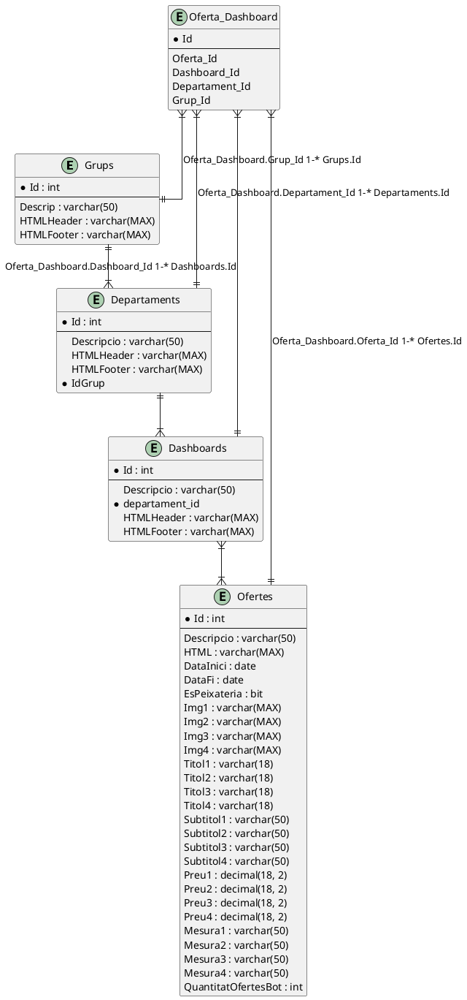

# [..](../..)\FlexyGO\Dashboards

```plantuml
@startuml
skinparam linetype ortho
entity "Grups" as g {
* Id : int
--
Descrip : varchar(50)
HTMLHeader : varchar(MAX)
HTMLFooter : varchar(MAX)
}
entity "Departaments" as d {
* Id : int
--
Descripcio : varchar(50)
HTMLHeader : varchar(MAX)
HTMLFooter : varchar(MAX)
* IdGrup
}
entity "Dashboards" as dd {
* Id : int
--
Descripcio : varchar(50)
* departament_id
HTMLHeader : varchar(MAX)
HTMLFooter : varchar(MAX)
}
entity "Ofertes" as o {
* Id : int
--
Descripcio : varchar(50)
HTML : varchar(MAX)
DataInici : date
DataFi : date
EsPeixateria : bit
Img1 : varchar(MAX)
Img2 : varchar(MAX)
Img3 : varchar(MAX)
Img4 : varchar(MAX)
Titol1 : varchar(18)
Titol2 : varchar(18)
Titol3 : varchar(18)
Titol4 : varchar(18)
Subtitol1 : varchar(50)
Subtitol2 : varchar(50)
Subtitol3 : varchar(50)
Subtitol4 : varchar(50)
Preu1 : decimal(18, 2)
Preu2 : decimal(18, 2)
Preu3 : decimal(18, 2)
Preu4 : decimal(18, 2)
Mesura1 : varchar(50)
Mesura2 : varchar(50)
Mesura3 : varchar(50)
Mesura4 : varchar(50)
QuantitatOfertesBot : int
}

entity "Oferta_Dashboard" as od {
* Id
--
Oferta_Id
Dashboard_Id
Departament_Id
Grup_Id
}

g ||--|{ d
d ||--|{ dd
dd }|--|{ o
od }|--|| o : Oferta_Dashboard.Oferta_Id 1-* Ofertes.Id
od }|--|| dd : Oferta_Dashboard.Dashboard_Id 1-* Dashboards.Id
od }|--|| d : Oferta_Dashboard.Departament_Id 1-* Departaments.Id
od }|--|| g : Oferta_Dashboard.Grup_Id 1-* Grups.Id
@enduml
```
